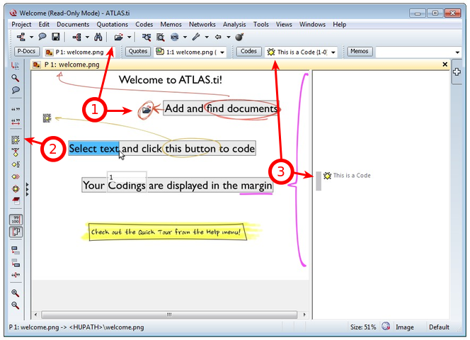

## Iniciar el programa

Trabajando con una instalación estándar, podemos arrancar el programa desde el icono ATLAS.ti que se encuentra en el escritorio de Windows. Alternativamente, podemos iniciar el programa desde el botón Inicio de Windows, siguiendo la ruta:

```Inicio > Programas > Scientific Software > ATLAS.ti 7```

También podemos iniciar el programa haciendo doble clic sobre una UH existente.

Al arrancar el programa por primera vez, ATLAS.ti cargará la UH *Welcome* (ver \ref{fig-UH-ejemplo}). Por defecto, al abrir el programa se cargará la última UH con la que se trabajó. Esta opción puede ser desactivada y, de serlo, el programaría arrancaría con una UH nueva y vacía. También podemos iniciar el programa haciendo doble clic sobre el nombre de una UH existente (evidentemente, el programa iniciará abriendo simultáneamente la UH sobre la que se ha hecho clic).



La UH *Welcome* ilustra la forma de realizar las operaciones más básicas y muestra simultáneamente qué tipo de elementos se generan con ellas. Esta UH nos señala el icono que permite añadir DPs. Nos muestra un código en el menú desplegable que le corresponde y también a la derecha del documento primario activado, junto a la cita que codifica. Es curioso que el único DP que incluye esta UH de bienvenida sea un archivo de imagen y no de texto.

Como vemos en la Ilustración, la interfaz del programa aparece, por defecto, en inglés. Si queremos cambiar de idioma podemos hacerlo con la opción Herramientas &gt; Preferencias &gt; Establecer idioma de interfaz de usuario. Las opciones que se nos ofrecen, además del inglés, son Español, Klingon [^1] y Alemán. Una vez que hemos cambiado el idioma, para que los cambios tengan efecto tenemos que reiniciar el programa.

Modificando la configuración de algunas de las opciones de ATLAS.ti, es posible activar la búsqueda de actualizaciones automáticas al arrancar el programa. La ventana de actualizaciones detalla el proceso de acceso de nuestro ordenador al servidor de ATLAS.ti para buscar paquetes de actualización que podemos descargar e instalar.

[^1]: Si seleccionamos Klingon, empezaremos a apreciar cómo en ocasiones el programa no es excesivamente serio (para más información: https://es.wikipedia.org/wiki/Klingon).
