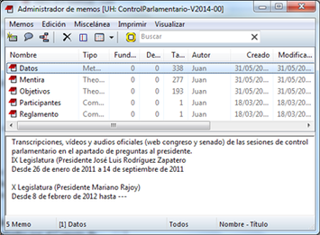
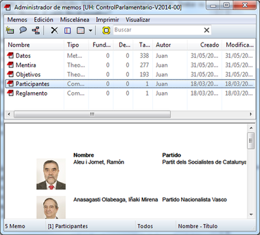

# Documentar nuestro trabajo: Memos

Ya hemos comentado previamente que una de las características de ATLAS.ti es que ofrece muchas posibilidades para documentar nuestro trabajo. En el capítulo anterior hemos visto, por ejemplo, la posibilidad de escribir un comentario genérico de la UH. Muchos otros componentes, como documentos, citas o códigos, permiten que también se les asocie un comentario descriptivo, pero disponemos, además, de la posibilidad de la escritura de *Memos*, es decir, memorandos, comentarios o anotaciones genéricos, no necesariamente asociados —aunque puedan asociarse— a ningún componente concreto.

Los *Memos*, constituyen, además un elemento fundamental del análisis, aunque muy a menudo, uno de los elementos más subutilizados. Es por eso, por su “olvido”, por su habitual relegación a un plano accesorio, por lo que apelaremos a otras voces para convencer de su importancia.

Por ejemplo, Komalsingh Rambaree, ilustra la funcionalidad de las memos concretamente al utilizar ATLAS.ti:

>Cuando los investigadores empiezan a pensar en un proyecto, pueden empezar, desde el principio del proceso de investigación, a utilizar ATLAS.ti para hacer reflexiones preliminares sobre las ideas y la construcción del conocimiento. Por ejemplo, se pueden crear memos libres, que se centran en la reflexividad sobre la puesta en marcha del proceso de investigación. La reflexividad básicamente significa hacer reflexiones sobre y dar cuenta de cómo se han tomado las decisiones y cómo han influido en el proceso de investigación. (Rambaree, 2013, p. 1).

Como vemos, Rambaree apuesta por la utilización de *Memos* desde un primer momento de la investigación, propuesta a la que nos sumamos, y que nos ha llevado a presentarlos prácticamente como primera actividad a realizar en un análisis.

Pero queremos insistir además en que su función va mucho más allá de la utilización de ATLAS.ti o de cualquier otra herramienta de análisis. Es decir, tienen que ver con el análisis, no con la herramienta, puesto que:

>Mediante el uso de memorandos, el investigador es capaz de sumergirse en los datos, explorar los significados que estos datos tienen, mantener la continuidad y mantener el impulso en la realización de la investigación. Como crónica de un viaje de investigación, los memorandos permanecen como un registro, indeleble pero flexible, para retención personal o para difundir a otros. (Birks, Chapman, & Francis, 2008, p. 69)

Y para finalizar,

>Vemos la toma de notas como crucial para todos los tipos y enfoques de análisis. Otras funciones, como la codificación, la búsqueda de texto, la codificación automática y la modelización pueden ser utilizadas por enfoques concretos, pero la anotación de los datos, documentos y material de apoyo es indivisible del análisis general. (Lewins & Silver, 2007, p. 59)

Y por si queda alguna duda de su relevancia, sugerimos que se haga una rápida búsqueda utilizando la palabra clave “memoing” junto a “qualitative research”. La cantidad no necesariamente implica calidad, pero puede darnos una pista sobre la relevancia de la temática y las reflexiones y discusiones que ha suscitado.

## Crear Memos

Para la creación de *Memos*, podemos seleccionar la opción *Crear memo libre* desde el menú *Memos* o, desde ese mismo menú, abrir el *Administrador de memos* y hacer clic en el icono de creación.

Lo primero que tendremos que hacer, será dar un nombre a nuestra *Memo*, y a continuación (y aquí viene lo más complicado), escribirla en el editor que nos aparecerá a continuación. En la figura \ref{fig-editor-memos} podemos apreciar que ese editor se diferencia del que habíamos visto al crear el comentario de UH. En este caso tenemos (1) una zona en la que aparece la etiqueta con la que hemos nombrado la *Memo*, y (2) una lista desplegable para seleccionar el tipo de *Memo*. Esta lista nos ofrece tres posibilidades, *Commentary*, *Method* y *Theory*. Es decir, podemos clasificar nuestras *Memos* en tres categorías diferentes^[O más, puesto que es posible editar esta lista en Preferencias > Preferencias generales , pestaña Memos.]. En este caso, a pesar de nuestra insistencia en la documentación y sistematización, nos sumamos a Saldaña (2009, p. 33) quien prefiere hablar únicamente de *memos analíticos*.

En la figura anterior vemos un posible ejemplo de *Memo*. En este caso, hemos creado un *Memo* *“Datos”* en el que describiremos de una forma genérica los datos que incluiremos en nuestro análisis. Parece evidente también que, dado que cualquier análisis no tiene sentido sin unos objetivos, podemos tener una *Memo* con la descripción de nuestros objetivos, de forma que los tengamos siempre “a mano” (sobre todo si el análisis lo realiza un equipo de analistas). En la figura \ref{fig-administrador-memos} podemos ver el administrador de *Memos*, en el que apreciamos una parte superior con la lista de *Memos* y una parte inferior con el texto de la *Memo* seleccionada.

Dos de esos memos tienen una característica particular, puesto que son en realidad archivos PDF que se están utilizando como *Memos*. Por ejemplo, el *Memo “*Reglamento” es un PDF con el reglamento del Congreso. No se trata de un documento que deseemos analizar, pero sí de un documento que es necesario conocer para poder entender mejor cómo transcurren las sesiones de control. Tenerlo como *Memo* nos permite tener un acceso fácil al mismo, sin necesidad de tener que “buscarlo” cada vez que tengamos necesidad de consultarlo.

Un caso similar es el del *Memo* “Participantes”, un PDF en el que hemos recogido todos los datos posibles sobre cada uno de los participantes en las sesiones de control. En la figura \ref{fig-memo-pdf} podemos ver cómo lo que se visualiza en la parte inferior del *administrador* es parte del archivo PDF.

En síntesis, los memos, progresivamente elaborados, desarrollados, revisados y organizados en el curso del análisis contienen —o al menos deberían contener— los aspectos más significativos del análisis, tanto en términos de resultados como de proceso. Más adelante (Inserción de objetos/ficheros, en pág. 55) explicamos con más detalle cómo utilizar esta funcionalidad.
