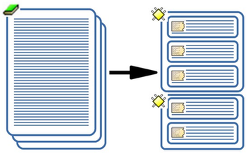

# Segmentar y codificar

En este apartado veremos dos de las tareas iniciales en buena parte de las modalidades de análisis cualitativo, la segmentación y codificación de nuestros datos, un proceso que nos permitirá realizar una primera “reducción” de los mismos. Como comentábamos anteriormente, parte del trabajo de análisis implica la reducción de los datos, pasar de los datos brutos originales a unidades significativas más manejables. Esto lo podemos hacer mediante la creación de citas (fragmentos significativos de texto) y su agrupación en códigos, entendidos como categorías que marcan conjuntos de citas con alguna característica en común (figura \ref{fig-segmentar-codificar}).

Dependiendo de nuestra perspectiva de análisis, el proceso de segmentación-codificación podemos realizarlo de dos formas diferentes. Si estamos realizando un análisis de tipo deductivo, partimos de una teoría previa que queremos contrastar con nuestros datos o dar cuenta de ella en términos empíricos, por lo que, en la práctica, muy probablemente partiremos de un conjunto de códigos predefinido y nuestro objetivo será “encontrar” en los datos citas que se correspondan con esos códigos.

Si, por el contrario, nuestro análisis es de tipo inductivo, entonces los códigos, en tanto que categorías con sentido teórico, no están definidos previamente, sino que se construyen a partir de la interpretación de los datos. Es a través de una lectura interesada de los datos que identificamos fragmentos significativos, los convertiremos en citas y posteriormente los relacionamos con códigos. La Teoría Fundamentada sería un ejemplo paradigmático de esta forma de proceder.

>En la investigación cualitativa, habitualmente un código es una palabra o frase corta que simbólicamente asigna un atributo sumativo, saliente, capturador de la esencia, y/o evocativo a una porción de datos textuales o visuales. (Saldaña, 2009, p. 3).

Como podemos ver en la figura \{fig-estrategias}, dependiendo de nuestra estrategia, variará la forma de realizar nuestro trabajo con ATLAS.ti. Si nuestra estrategia es deductiva, primero crearemos *Códigos libres*, mientras que si nuestra estrategia es inductiva primero crearemos *Citas* (también libres).

De todas formas, el iniciar el trabajo de una u otra forma (creando códigos o creando citas), no necesariamente implica que estemos realizando un análisis deductivo o inductivo. Por ejemplo, si estamos realizando un trabajo de análisis en equipo, de forma que los diferentes analistas trabajarán sobre diferentes documentos, una posibilidad es, antes de iniciar el trabajo con ATLAS.ti, consensuar, un “libro de códigos” común para todos los analistas. Esto no significa necesariamente que el análisis sea deductivo, puesto que esos códigos pueden haber surgido de un trabajo inductivo previo mediante la lectura de los datos.

Una aproximación que podríamos llamar intermedia y que en alguna medida guarda relación con la noción de abducción propuesta por Charles Sanders Peirce (Psillos, 2009), partiría de la especificación de los aspectos, dimensiones o áreas de interés sobre las cuales se buscaría construir códigos como forma de especificar los hallazgos en cada una de esas dimensiones o áreas. Desde esta aproximación, la teoría inicial es fundamental no en una lógica hipotético-deductiva, sino como marco orientador en la interpretación del fenómeno de interés. Por nuestra parte, aunque privilegiamos las formas de análisis orientadas a la construcción de categorías específicas sobre el fenómeno estudiado, empezaremos explicando la creación de códigos para posteriormente hablar de la creación de citas y la relación de citas con códigos.

