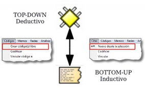
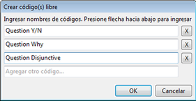
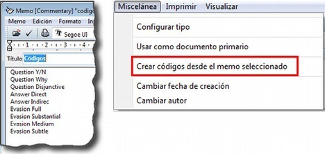
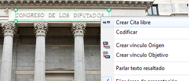
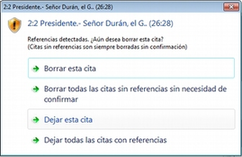
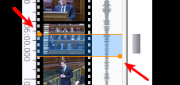
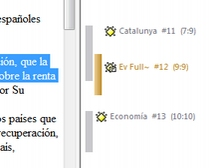
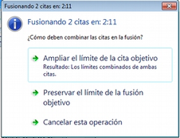

# Segmentar y codificar

En este apartado veremos dos de las tareas iniciales en buena parte de las modalidades de análisis cualitativo, la segmentación y codificación de nuestros datos, un proceso que nos permitirá realizar una primera “reducción” de los mismos. Como comentábamos anteriormente, parte del trabajo de análisis implica la reducción de los datos, pasar de los datos brutos originales a unidades significativas más manejables. Esto lo podemos hacer mediante la creación de citas (fragmentos significativos de texto) y su agrupación en códigos, entendidos como categorías que marcan conjuntos de citas con alguna característica en común (figura \ref{fig-segmentar-codificar}).

Dependiendo de nuestra perspectiva de análisis, el proceso de segmentación-codificación podemos realizarlo de dos formas diferentes. Si estamos realizando un análisis de tipo deductivo, partimos de una teoría previa que queremos contrastar con nuestros datos o dar cuenta de ella en términos empíricos, por lo que, en la práctica, muy probablemente partiremos de un conjunto de códigos predefinido y nuestro objetivo será “encontrar” en los datos citas que se correspondan con esos códigos.

Si, por el contrario, nuestro análisis es de tipo inductivo, entonces los códigos, en tanto que categorías con sentido teórico, no están definidos previamente, sino que se construyen a partir de la interpretación de los datos. Es a través de una lectura interesada de los datos que identificamos fragmentos significativos, los convertiremos en citas y posteriormente los relacionamos con códigos. La Teoría Fundamentada sería un ejemplo paradigmático de esta forma de proceder.

>En la investigación cualitativa, habitualmente un código es una palabra o frase corta que simbólicamente asigna un atributo sumativo, saliente, capturador de la esencia, y/o evocativo a una porción de datos textuales o visuales. (Saldaña, 2009, p. 3).

Como podemos ver en la figura \{fig-estrategias}, dependiendo de nuestra estrategia, variará la forma de realizar nuestro trabajo con ATLAS.ti. Si nuestra estrategia es deductiva, primero crearemos *Códigos libres*, mientras que si nuestra estrategia es inductiva primero crearemos *Citas* (también libres).

De todas formas, el iniciar el trabajo de una u otra forma (creando códigos o creando citas), no necesariamente implica que estemos realizando un análisis deductivo o inductivo. Por ejemplo, si estamos realizando un trabajo de análisis en equipo, de forma que los diferentes analistas trabajarán sobre diferentes documentos, una posibilidad es, antes de iniciar el trabajo con ATLAS.ti, consensuar, un “libro de códigos” común para todos los analistas. Esto no significa necesariamente que el análisis sea deductivo, puesto que esos códigos pueden haber surgido de un trabajo inductivo previo mediante la lectura de los datos.

Una aproximación que podríamos llamar intermedia y que en alguna medida guarda relación con la noción de abducción propuesta por Charles Sanders Peirce (Psillos, 2009), partiría de la especificación de los aspectos, dimensiones o áreas de interés sobre las cuales se buscaría construir códigos como forma de especificar los hallazgos en cada una de esas dimensiones o áreas. Desde esta aproximación, la teoría inicial es fundamental no en una lógica hipotético-deductiva, sino como marco orientador en la interpretación del fenómeno de interés. Por nuestra parte, aunque privilegiamos las formas de análisis orientadas a la construcción de categorías específicas sobre el fenómeno estudiado, empezaremos explicando la creación de códigos para posteriormente hablar de la creación de citas y la relación de citas con códigos.

## Creación de códigos

### Códigos libres

Como podemos ver en la figura \ref{fig-opciones-codigos-libres} (izquierda), la primera opción del menú *Códigos*, nos permite la creación de códigos “libres”, es decir, códigos que en principio no están relacionados con ningún otro elemento. También podemos crear códigos libres desde el *Administrador* de códigos, utilizando la misma opción del menú o con el icono de creación (figura \ref{fig-opciones-codigos-libres}, derecha).

En ambos casos, nos aparecerá una nueva ventana (figura \ref{fig-creacion-codigos-libres}) en la que introduciremos la etiqueta de código. Como podemos ver, a medida que vamos introduciendo etiquetas de código, se añaden nuevas filas en la ventana, por lo que podemos crear varios códigos de forma simultánea, hasta que hagamos clic en el botón *OK*.

La etiqueta de código debe ser clara y concisa, y aunque puede ser relativamente extensa, es preferible no utilizar nombres excesivamente largos pues complicaría la visualización de los códigos en el margen derecho. La descripción detallada la realizaremos como comentario (ver Comentarios de códigos en pág. 71).

Desde el momento de su creación todos los códigos tienen exactamente las mismas características. ATLAS.ti no realiza ningún tipo de jerarquización definida como propiedad específica de cada uno de los códigos. No podemos asignar a los códigos diferentes niveles, más genéricos o más específicos, o definirlos en función de tipos preestablecidos como subcategorías, categorías, dimensiones, etc... Más adelante veremos la forma de especificar estos atributos a partir del establecimiento de determinados tipos de relación entre códigos (Relaciones entre Códigos, pág. 104). Si queremos realizar algún tipo de distinción entre códigos que no sea de carácter relacional podemos utilizar alguna estrategia que nos permita diferenciarlos visualmente. Una posibilidad sería escribir en mayúsculas la etiqueta de un “código de nivel 1”, con mayúscula inicial la etiqueta de un “código de nivel 2” y en minúsculas la de un “código de nivel 3”. Otra posibilidad consistiría en usar prefijos (e.g., N1\_ para nivel 1, N2\_ para nivel 2 y así sucesivamente) lo cual además permitiría ordenar los códigos en función del atributo de interés. También tenemos la posibilidad de “jugar” con la opción Códigos &gt; Miscelánea &gt; Cambiar color para asignar diferentes colores a los códigos en función de su nivel u otras distinciones de interés en el curso del análisis. Podemos utilizar esta opción de colorear para otras funciones, como por ejemplo asignar un color determinado a los códigos que consideramos requieren un trabajo adicional^[Cuando un código tiene asignado un color, aparecerá con ese color en las vistas de red.].

En el ejemplo de la Ilustración hemos añadido un conjunto de códigos que utilizaremos durante el texto para ilustrar algunas funcionalidades. Se trata de la clasificación de tipos de preguntas y respuestas formulada por Parameswary Rasiah (2010) en su análisis de las respuestas evasivas en el discurso parlamentario. Los códigos que aparecen remiten a diferentes tipos de preguntas. Si tenemos un código como “Question” podemos entenderlo como el “código de nivel 1”. Códigos que remitan a formas especificas de evadir preguntando como los que aparecen en la ilustración serían “códigos de nivel 2” (y por lo tanto su etiqueta empieza con una letra en mayúscula). Por lo tanto el código “Question” lo etiquetaríamos como “QUESTION” o “N1\_Question”, según la pauta empleada.

Si tenemos previamente definida una amplia lista de códigos, existen otras formas rápidas de crearlos. Podemos, por ejemplo, crear un archivo de texto con la lista de códigos (un código por línea) e importarlo a ATLAS.ti utilizando la opción Códigos &gt; Importar/Exportar &gt; Importar lista de códigos. El único requisito que tiene que cumplir el archivo es que sea un archivo sólo texto pero que tenga extensión “COD” (por ejemplo “Codigos.cod”).

Otra forma, quizás más sencilla de añadir una lista amplia de códigos es creando un *Memo* con las mismas características que el archivo anterior, es decir, un nombre de código por línea (figura \ref{fig-creacion-codigo-memo}, izquierda), y una vez guardado el *Memo* utilizar la opción Miscelánea &gt; Crear códigos desde el memo seleccionado del administrador de memos (figura \ref{fig-creacion-codigo-memo}, derecha).

### Comentarios de códigos

Una vez más, mientras vamos creando los códigos, es conveniente dedicar un tiempo a su descripción, es decir, a crear comentarios. Si los comentarios son elementos importantes de los componentes que hemos visto hasta el momento (UH y DPs), lo son mucho más en el caso de los códigos, sobre todo cuando el trabajo de codificación es compartido por varios analistas. Es fundamental que el significado de los códigos, tanto conceptual como operativamente, alcance cierto grado de estabilidad durante el análisis, de forma que un mismo codificador interprete y aplique de la misma forma un código en diferentes momentos el proceso de análisis o que varios codificadores interpreten de la misma forma un mismo código. En algunos casos la simple etiqueta puede parecer lo suficientemente descriptiva como para que no haga falta escribir un comentario. Sin embargo, conforme progresa el análisis o cuando intervienen distintas distintos analistas, esa aparente claridad puede no serlo del todo en la práctica.

Una posible forma de sistematizar los contenidos a añadir a los comentarios de códigos es seguir el modelo que proponen MacQueen, McLellan, & Milstein (1998), del que ofrecemos un ejemplo en la Tabla.

| ELEMENTO              | EJEMPLO                                                                                                                                                                                                                                                                               |
|:----------------------|:--------------------------------------------------------------------------------------------------------------------------------------------------------------------------------------------------------------------------------------------------------------------------------------|
| **Etiqueta**          | MARGIN                                                                                                                                                                                                                                                                                |
| **Definición breve**  | Miembros marginados de la comunidad                                                                                                                                                                                                                                                   |
| **Definición amplia** | Grupos que son percibidos negativamente como social y/o físicamente outsiders a la estructura comunitaria principal. En los grupos marginados las fronteras son impuestas por los otros para evitar que los grupos “no favorables” participen o interactúen con los grupos dominantes |
| **Cuándo usar**       | Aplicar este código a todas las referencias a grupos de personas que ha marginado el resto de la comunidad. Esas personas o grupos pueden ser descritos como parias, extremistas, radicales, o explícitamente descritos como periféricos, extranjeros, outsiders, estrafalarios, etc. |
| **Cuándo no usar**    | No usar este código para referirse a grupos institucionalizados por motivos de salud o criminales (ver INSTIT) o para grupos que se han ubicado voluntariamente alejados de la vida de la comunidad (ver SELMFAR)                                                                     |
| **Ejemplo**           | “Entonces tienes a los parias negros —camellos, yonquis, prostitutas.”                                                                                                                                                                                                                |
  : Elementos comentarios de códigos (MacQueen, McLellan, Kay y Milstein ,1998)

No estamos sugiriendo, de todas formas, que se utilice este modelo de una forma mimética para cada uno de nuestros códigos. En algunos casos puede ser casi imprescindible este nivel de especificidad, mientras que en otros una simple etiqueta amplia puede ser suficiente. Por otra parte, el comentario puede ser también el lugar donde podemos empezar a elaborar hipótesis sobre el tipo de significado del código, donde podemos empezar a preguntarnos por el tipo de relaciones que se pueden establecer entre este código y otros, etc. El que estos comentarios pertenezcan a la “categoría” *comentario* o a la categoría *Memo* puede ser una cuestión de matiz, una pequeña diferencia cualitativa. De hecho, algo que puede empezar siendo un comentario de código puede acabar convirtiéndose, a medida que va haciéndose más compleja, en un *Memo*. De todas formas, nuestro criterio suele ser que si el comentario va más allá de la descripción del código, es mejor crear un *Memo* y vincularlo con el *código* (ver Relaciones con Memos, pág.108).

### Visualización

A medida que vamos creando códigos, estos aparecerán tanto en la lista desplegable de códigos como en el administrador de códigos.

La única información que podremos ver en la lista desplegable es el nombre de código junto a dos números entre corchetes. El primer número hace referencia a la cantidad de *citas* con las que está relacionado el código, mientras que el segundo número lo hace respecto a los otros códigos con los que el código en cuestión está relacionado (ver Relaciones entre Códigos, en pág. 104). Además, en algunas ocasiones veremos el signo \~, que nos indica que el código tiene un comentario. Operativamente hablando, el comentario puede ser solo un punto, por ejemplo, lo cual probablemente carece de interés desde el punto de vista de los fines del análisis. Sin embargo, la herramienta seguiría considerando que, en este caso, el código está comentado y presentaría el signo \~.

El administrador de códigos (figura \ref{fig-administrador-codigos}) incluye, además de la información anterior, el nombre del usuario creador del código, la fecha de creación y modificación y las familias a las que pertenece. La columna *Fundamentado* hace referencia al número de citas vinculadas al código, mientras que la columna *Densidad* lo hace con respecto al número de relaciones con otros códigos. Además, como en todos los administradores, tenemos la zona de comentario^[Este es formato de visualización por defecto, pero en todos los administradores pueden elegirse otros formatos desde el menú *Visualización*.].

## Citas

Como hemos comentado anteriormente, nuestra estrategia de análisis puede implicar crear las citas antes que los códigos, aunque como también veremos, en muchas ocasiones crearemos las citas al mismo tiempo que creamos y/o aplicamos los códigos.

## Creación de citas “libres”

Si nuestro análisis es de tipo inductivo, una posibilidad es que empecemos creando *citas libres* a partir de la lectura del texto y la identificación de fragmentos que tienen algún significado en función de nuestros objetivos de análisis.

Para la creación de *citas libres*, lo único que tenemos que hacer es seleccionar el fragmento de texto, hacer clic sobre él con el botón derecho del ratón y seleccionar la opción *Crear Cita libre* en el menú contextual que aparecerá. Podemos crear la cita también con la opción *Nuevo desde la selección* del menú *Citas*. Por último, también podríamos crearla arrastrando el texto seleccionado hasta el administrador de citas.

### Citas multimedia

De la misma forma que con los documentos con formato texto, podemos crear citas en los documentos multimedia, ya sean imágenes, audio o vídeo, aunque el proceso de selección del fragmento significativo será diferente.

En el caso de las imágenes, simplemente tenemos que seleccionar con el ratón el fragmento deseado de la imagen en una sección rectangular y, como antes, hacer clic sobre él con el botón derecho del ratón para seleccionar la opción *Crear Cita libre* (figura \ref{fig-cita-imagen}). Podemos crear citas de esta forma tanto en los documentos de imagen (archivos *jpg*, p*ng*...) como en las imágenes incluidas en los documentos de tipo PDF, pero no en imágenes que formen parte de un documento de texto que no sea PDF. En ese caso sólo puede convertirse en cita le imagen completa.

En el caso de los documentos de audio y de vídeo, el proceso de creación de la cita implicará como primer paso seleccionar un punto de inicio y un punto final en la línea de tiempo que definen el lapso a transformar en cita. Para ello, utilizaremos los iconos que podemos ver en la figura \ref{fig-cita-multimedia}.

El primero define el punto de inicio de la cita, el segundo el punto de finalización y el tercero permite crea la cita. Recomendamos que la “mecánica” de la creación de la cita sea la siguiente:

1. Marcar el inicio en el momento deseado mientras se va reproduciendo el archivo (1).

2. Una vez que lleguemos al punto en el que queremos que finalice la cita hacer pausa en la reproducción.

3. Marcar el punto final de la cita (2).

4. Crear la cita (3).

Si hacemos clic en el icono de creación de cita después de marcar un punto de inicio y antes de marcar un punto final, se creará el punto final y la cita al mismo tiempo.

### Visualización

La visualización en la lista desplegable nos muestra el símbolo \~, indicándonos que la cita tiene un comentario. El identificador numérico de la cita, que aparece a continuación, está compuesto de un primer número que indica el DP al que pertenece la cita, y de un segundo número conforme al orden en que se ha creado la cita. A continuación, aparecerá la etiqueta de la cita. Si trabajamos con DP de texto, la etiqueta es consistente en los primeros caracteres del contenido de la cita. Finalmente, los últimos números nos indican el párrafo de inicio y fin de la cita. En el caso de que la cita esté relacionada con otras citas, veremos también los signos &lt; o &gt;, según la posición que ocupe en la relación.

La lista desplegable y el administrador de citas también nos permiten seleccionar una cita para su visualización contextualizada en el documento al que pertenecen. En el caso del administrador, podemos desplazarnos por ellas haciendo doble clic sobre sus etiquetas. En ese caso, en la pantalla principal se visualizará el documento primario al que pertenece la cita en la sección en la que la cita se ubica y ésta aparecerá seleccionada. También podemos desplazarnos fácilmente de una cita a otra utilizando los iconos de desplazamiento  del administrador.

## Codificación

Podemos entender las estrategias de segmentación/codificación explicadas hasta el momento como formas “puras” de análisis deductivo o inductivo. En la práctica, lo que haremos habitualmente será realizar de forma simultánea ambas tareas, la de creación de citas y, al menos en los primeros momentos del análisis, la de creación y aplicación de códigos.

Como podemos ver en la figura \ref{fig-opciones-codificaciones}, el menú contextual que aparece después de seleccionar un fragmento de texto y hacer clic sobre él con el botón derecho, nos ofrece varias opciones de codificación. Todas ellas implican que de forma simultánea se creará una cita, un código (si no existe previamente) y una relación entre la cita y el código.

La primera opción, *Ingresar nombre(s) de código* abrirá una nueva ventana, como la que veíamos previamente al crear *códigos libres* (ver Ilustración, pág. Ilustración) en la que introduciremos los nombres de nuevos códigos y simultáneamente los relacionaremos con la cita. Si introdujésemos el nombre de un código exactamente igual a uno ya existente, ATLAS.ti no creará uno nuevo, sino que utilizará el que ya existe para codificar la cita.

La opción *Código In Vivo* es una forma especial de creación de códigos en la que el nombre de código se corresponderá con el texto seleccionado. No es conveniente, por lo tanto, utilizar esta opción con fragmentos largos de texto (habitualmente se utiliza como selección sólo una palabra). La codificación *en vivo* es algo más que una de las formas de codificación utilizadas por ATLAS.ti. Para saber más sobre ella, ver por ejemplo Strauss & Corbin, 2002.

La opción *Seleccionar código(s) de la lista* visualizará una ventana con la lista de códigos creados previamente en la que podemos seleccionar uno o varios códigos para relacionar con la cita. En procesos de análisis con una lógica inductiva, esta opción se vuelve más recurrente en momentos posteriores del proceso de segmentación y codificación, cuando ya contamos con un buen número de códigos creados.

Finalmente, la opción *Último código(s) usado:\_\_\_\_\_\_\_\_\_\_\_\_\_,* que aparece completada con el nombre del último o últimos códigos aplicados a una cita, permitirá codificar el fragmento seleccionado con el último código que hayamos utilizado. Si en una sesión de trabajo todavía no se ha aplicado algún código, la opción aparece desactivada.

## Autocodificación

La opción de *Autocodificación* permite que el programa realice un proceso de codificación automático con base en los criterios que defina el analista. Más concretamente, la autocodificación se realiza a partir de la búsqueda de determinados fragmentos de texto en los documentos que, una vez identificados, serán autocodificados.

En el ámbito de la investigación cualitativa es cuestionable la utilización de esta opción de una forma generalizada. De hecho es algo que desaconsejamos si lo que se pretende es sustituir el trabajo necesariamente pormenorizado e interpretativo del analista. Sin embargo, consideramos pertinente la utilización de esta función como recurso complementario. Un ejemplo de ello sería el uso de la autocodificación como medio de identificación de participantes. De considerarse útil o necesario podríamos identificar y codificar en nuestros datos las intervenciones de cada uno de los participantes, lo que nos permitiría posteriormente seleccionar las intervenciones de cada uno de ellos para determinados fines analíticos.

Puesto que la búsqueda de texto es el elemento básico de la autocodificación y puesto que la herramienta de búsqueda de texto presenta en ATLAS.ti ciertas diferencias respecto a otros programas, antes de profundizar en la autocodificación es conveniente que leas el apartado dedicado a la herramienta Search (ver Buscar texto en pág. 133).

En la figura \ref{fig-autocodificacion} podemos ver un ejemplo en el que vamos a autocodificar todas las intervenciones del presidente Zapatero. En primer lugar (1) seleccionaremos el código con el que queremos trabajar. Si no lo hemos hecho previamente, podemos crearlo en (2). A continuación tenemos que especificar el texto de búsqueda para identificar las intervenciones del presidente Zapatero. Dado que dichas intervenciones van precedidas por el texto “Presidente.-”, en (3) escribiremos dicho texto exactamente, incluyendo .-, de esta forma evitaremos que los resultados de la búsqueda incluyan la aparición de la palabra “Presidente” en partes del texto que no sean el identificador de hablante. Es importante que en el momento de preparación de los datos previo a la asignación utilicemos etiquetas de hablante/participante que sean “únicas”, es decir, que no puedan aparecer en otras partes del texto. Una posibilidad es, que la etiqueta vaya seguida de algún carácter especial, por ejemplo .-, como en nuestros datos.

Podemos seleccionar (4) que la búsqueda de la cadena de texto especificada se realice únicamente en el documento activo, en todos los documentos asignados a la HU, o en una familia de documentos. En nuestro caso, dado que nuestros datos incluyen dos legislaturas y el Sr. Zapatero sólo interviene en una de ellas, hemos optado por seleccionar la familia de documentos “Legislatura IX”. De esta forma, la búsqueda sólo afectará a los documentos que hemos asignado a la familia de documentos X Legislatura, creada anteriormente (ver Familias, pág. 91).

El siguiente paso (5) consiste en definir la extensión de la cita una vez que la búsqueda haya sido exitosa. Si la búsqueda arroja algún resultado, se creará una cita que puede variar de tamaño en función de la elección que hayamos realizado en *Crear cita desde el resultado hasta:*. Por ejemplo, en el caso de que hayamos seleccionado como criterio de búsqueda, la expresión “Ent”, cada vez que ésta aparezca en el documento se creará una cita de la siguiente forma:

| Parámetro                 | Acción                                                                                                                                            |
|:--------------------------|:--------------------------------------------------------------------------------------------------------------------------------------------------|
| Resultado exacto          | El texto exacto que hemos introducido como expresión de búsqueda: **Ent**                                                                         |
| Palabra                   | La palabra completa en la que aparece el texto buscado: **Ent**revistador, **ent**revistadora, pat**ent**e                                        |
| Oración                   | La frase en la que aparece el texto buscado, desde al menos un punto y seguido antes hasta un punto y seguido después                             |
| Salto de línea simple     | El párrafo en el que aparece. En este caso se entiende como párrafo cualquier texto separado por un salto de línea manual (un “return” o “intro”) |
| Múltiples saltos de línea | El párrafo en el que aparece. En este caso el programa interpreta como párrafo el texto separado por más de un salto de línea manual              |
| Todos los textos          | Seleccionará como cita todo el documento primario                                                                                                 |
  : Autocodificación: opciones de creación de la cita

En nuestro caso seleccionamos la opción *Múltiples saltos de línea*, puesto que las intervenciones de un mismo hablante pueden incluir varios párrafos (salto de línea simple), mientras que las intervenciones de dos personas diferentes están separados por un doble salto de línea.

En (6) podemos definir otra serie de opciones para controlar el proceso de la autocodificación: elegir que la búsqueda discrimine mayúsculas de minúsculas, utilizar las opciones de búsqueda “GREP” (ver Búsqueda GREP en pág. 137), y hacer que se solicite confirmación antes de proceder a la codificación del resultado de búsqueda. Es muy conveniente tener activa esta última opción, por lo menos al inicio, hasta que hayamos confirmado que la autocodificación funciona de forma satisfactoria.

Una vez que hemos definido todos estos parámetros, podemos hacer clic sobre el botón *Inicio* (7), para que se inicie la autocodificación. Si hemos activado la opción *Confirmar siempre*, se nos pedirá confirmación para realizar la autocodificación cada vez que se encuentre un texto que cubra los criterios definidos en la expresión de búsqueda, ofreciéndonos las opciones *Codifícalo* o *Saltarlo*. En caso contrario, la autocodificación se realizará automáticamente. **Insistimos en que es altamente recomendable utilizar esta opción para confirmar que efectivamente queremos que el texto encontrado se convierta en una cita**, puesto que una sentencia de búsqueda no siempre selecciona exactamente el texto que esperamos, lo que puede llevar a codificaciones incorrectas. Si hemos seleccionado la opción *Confirmar siempre*, podemos desactivarla después de realizar alguna autocodificación y comprobar que el resultado de la búsqueda es el deseado.

Una vez que hemos autocodificado las intervenciones del presidente Zapatero, podemos continuar realizando el mismo proceso para las intervenciones de Mariano Rajoy. En este caso, sin embargo, podemos tener en cuenta que Mariano Rajoy era el líder de la oposición durante la IX legislatura (mientras Zapatero era presidente) y presidente durante la X legislatura. Optamos por lo tanto por crear dos códigos diferentes: RajoyLO (para Rajoy como líder de la oposición) y RajoyPR (para Rajoy como presidente). Por lo tanto, para autocodificar RajoyLO utilizaremos “Sr. Rajoy.-” como sentencia de búsqueda y la familia de documentos “Legislatura IX” como *Alcance de la búsqueda*, mientras que para autocodificar “RajoyPR” la sentencia de búsqueda será “Presidente.-” seleccionando en este caso la familia de documentos “Legislatura X”.

Para el resto de participantes podemos actuar de la misma manera, de forma que finalmente tendremos una UH en la que todas y cada una de las intervenciones de cada participante tendrá asociado su correspondiente código.

## Visualización

### Margen derecho

A medida que vamos realizando el trabajo de codificación, el margen derecho de la pantalla principal irá mostrando información sobre las citas y códigos que hemos ido creando.

En la figura \ref{fig-margen-derecho} podemos ver en el margen derecho unas barras verticales que informan de la ubicación de las citas. Si hacemos clic sobre alguna de esas barras, la cita correspondiente quedará seleccionada y resaltada en el documento. Si las citas no son citas libres y están relacionadas con códigos, a su lado aparecerá la etiqueta de los códigos correspondientes. Como podemos ver, para facilitar la visualización, tanto las barras como las etiquetas de código pueden ser de diferentes colores. En el ejemplo, tenemos seleccionada una cita codificada con el código *Ans Direct* y que se corresponde con la primera parte de la intervención de uno de los participantes. Tanto el código como la barra vertical que indica la existencia de la cita tienen el mismo color. El conjunto de la intervención está recogido en otra cita, indicada por la barra vertical gris, que a su vez está codificada como *Respuesta* y como *Zapatero,* etiquetas de código también en gris.

### Visualización de las citas de un código

Ya hemos visto que el margen derecho de la pantalla principal nos permite una visualización en contexto de nuestra codificación, es decir, a medida que vamos leyendo el texto podemos ver las citas que hemos creado y los códigos a las que han sido asignadas. Sin embargo, nos puede interesar tener una perspectiva diferente de nuestros datos, ya no según su ubicación en el documento sino en función de un rasgo o una temática concreta, es decir, focalizada en un código concreto. Con toda seguridad nos interesará ver qué fragmentos de información hemos codificado con determinados códigos. Para ello tenemos dos opciones. La primera será “navegar” en pantalla por las citas de un código. Para ello, sólo tenemos que hacer doble clic sobre un código (en el a*dministrador de códigos*), lo que nos abrirá una ventana con la lista de citas con las que está relacionado. Al hacer clic sobre cualquier cita, la visualizaremos en pantalla. También podemos realizar un “recorrido” por las citas de un código seleccionándolo y utilizando los iconos de la barra del *administrador de códigos*. En la figura \ref{fig-visualizar-citas-codigo} podemos ver cómo después de hacer doble clic sobre el código *Ev Substantial* aparece la ventana de las diez citas relacionadas con el código.

Esta forma de visualizar las citas es interesante, pero si lo que queremos es realizar una lectura más pausada de las mismas, probablemente nos sea más útil imprimir un listado de citas. De hecho, una tarea habitual del analista debería ser la lectura focalizada de las citas de códigos, para asegurarse de que todas las citas que se han incluido en un código son instancias adecuadas de ese código, para construir o refinar la definición del código y también para comparar los contenidos de dos códigos. Por ejemplo, una vez que hemos realizado una primera codificación de los códigos relacionados con las respuestas evasivas deberíamos repasar los contenidos —las citas— de cada uno de los códigos sobre evasión —*Ev Subtle*, *Ev Medium*, *Ev Substantial* y *Ev Full—* para depurarlos y, comparativamente, para asegurar que se está discriminando entre las distintas formas de evasión. Para ello, tendríamos que imprimir informes con las citas de cada uno de esos códigos (ver Informes, pág. 181).

## Operaciones sobre citas y códigos

### Eliminar citas y códigos

Podemos eliminar tanto citas como códigos haciendo clic en el icono  del administrador correspondiente. Las citas también podemos eliminarlas desde el menú contextual que aparece al hacer clic sobre el texto de la cita o la barra de cita en la pantalla principal. Si la cita está relacionada con algún código o con otra cita —cita no libre— se nos pedirá confirmación antes de eliminarla definitivamente (figura \ref{fig-confirmacion-eliminar-cita}).

Hay que ser extremadamente cauteloso a la hora de realizar esta tarea, puesto que a la fecha, en ATLAS.ti no es posible deshacer una acción de este tipo.

En el caso de los códigos ocurrirá lo mismo, se nos pedirá confirmación si el código tiene algún tipo de relación con citas, con otros códigos, o con cualquier otro objeto (figura \ref{fig-confirmacion-eliminar-codigo}).

### Modificar extensión cita

Si queremos modificar una cita ya existente cambiando su punto de inicio y/o final, tenemos que

1) Seleccionar la cita en la lista desplegable de citas o haciendo clic en la barra vertical de cita, desde el margen derecho.

2) Modificar la selección, es decir, seleccionar el nuevo texto que queremos que quede asignado a esa cita.

3) Hacer clic en el icono  de la barra de iconos de documento o en la opción *Modificar tamaño de la cita* del menú *Citas*.

Este procedimiento lo utilizaremos tanto para los documentos de texto como para las imágenes.

 Para los documentos de audio o vídeo, el procedimiento es similar, pero en esta ocasión el segundo paso, la modificación de los límites de la cita, lo realizaremos desplazando las barras limitadoras (figura \ref{fig-modificacion-multimedia}). Finalmente, como podemos ver en la figura \ref{fig-modificacion-pdf}, procederemos de una forma similar con los documentos de tipo PDF.

### Fusionar citas

Además de modificar la extensión de una cita, en ocasiones también querremos unir varias citas en una única, pues podemos considerar, por ejemplo, que la segmentación original ha sido excesivamente específica. El proceso implicará, en primer lugar, seleccionar la cita que queremos conservar (la cita *objetivo*) y a continuación utilizar la opción Citas &gt; Miscelánea &gt; Fusionar citas. En la siguiente secuencia de ilustraciones, vemos que partimos de tres citas que, además, están relacionadas con un código diferente cada una de ellas. Nuestro objetivo es fusionar la cita \#11, codificada como *Catalunya* y la \#13, codificada como *Economía*, en la cita \#12, codificada como *Ev Full*. Al seleccionar la cita \#12 (figura \ref{fig-fusionar-destino}) y hacer clic en *Fusionar citas* nos aparecerá una nueva ventana con el resto de citas del DP. Una vez hemos seleccionado las citas a fusionar, tendremos que decidir la forma de fusión en la ventana emergente (figura \ref{fig-fusionar-modalidad}).

Las opciones que tenemos son *Ampliar el límite de la cita objetivo* y *Preservar el límite de la fusión objetivo*. En la Ilustración vemos los resultados de ambas opciones. A la izquierda vemos que el resultado de *ampliar* es una única cita, la \#12, cuyos límites se han ampliado para incluir el texto de las citas \#11 y \#13. En la parte derecha de la figura \ref{fig-fusionar} vemos cómo el resultado de *preservar* sigue siendo una única cita, pero en esta ocasión el texto que incluye es el original de la cita objetivo. En ambos casos los códigos con los que estaban relacionados las citas \#11 y \#13 pasan a estar asociados con la cita objetivo.

### Fusionar códigos

El proceso de depuración puede implicar también la necesidad de fusionar códigos. Esto puede deberse a que en la primera ronda de codificación hayamos creado códigos demasiado específicos y posteriormente consideramos que para nuestros objetivos puede ser suficiente con un código más genérico.

Imaginemos, por ejemplo, que hemos decidido codificar todas las intervenciones en que aparece alguna referencia a relaciones internacionales entre España y otros países y que, en un primer momento hemos optado por crear diferentes códigos, uno para cada país al que se haga referencia, y que tenemos, por lo tanto códigos del tipo *RI-Francia*, *RI-Italia*, *RI-EEUU*, etc. Si posteriormente consideramos que en el caso de los países europeos es suficiente con diferenciar entre aquellos que son miembros de la Unión Europea y los que no, podemos optar por fusionar los códigos necesarios en un nuevo código *RI-UniónEuropea*. Para ello utilizaremos la opción Códigos &gt; Fusionar códigos.

Como podemos ver en la figura \ref{fig-fusion-comentario}, una vez realizada la fusión, el código resultante incorporará una notificación de la fusión realizada así como los comentarios de los códigos fusionados. La notificación de la fusión sólo aparece cuando los códigos que se fusionan contienen comentarios.

### Desvincular cita/código

En ocasiones podemos querer “descodificar”; es decir, eliminar la relación entre una cita y un código. Esto nos puede interesar bien porque hayamos cometido un error al codificar o bien porque en el proceso de depuración de los códigos decidamos que es mejor eliminar esa relación.

En esos casos, tenemos dos opciones. Si la cita está relacionada única y exclusivamente con un código y no queremos mantenerla como tal, podemos proceder simplemente a eliminar la cita como veíamos anteriormente. Pero si queremos mantener la cita y eliminar únicamente la relación con el código, sea porque la misma cita está codificada por otros códigos o por otra razón, la acción a realizar es la de *Desvincular códigos*, accesible desde el menú contextual de la barra de cita, en el margen derecho (figura \ref{fig-desvincular}, izquierda). Al activar esta opción, aparecerá una ventana con los códigos con los que esté relacionada la cita (figura \ref{fig-desvincular}, derecha) y podemos elegir entonces desvincularla de todos o algunos de ellos. Podemos realizar el mismo proceso desde el menú contextual accesible en la etiqueta de código al lado de la barra de cita, pero con esta opción no se nos pedirá confirmación.

