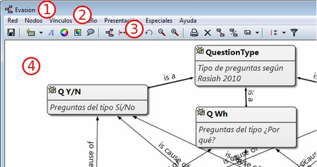
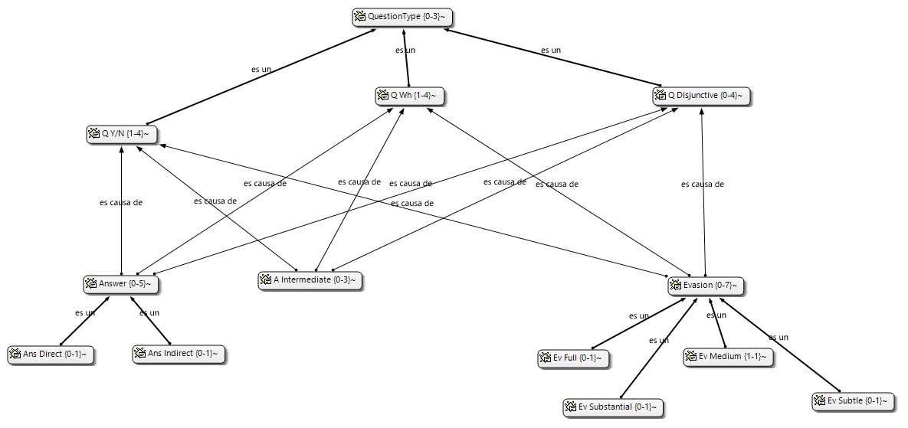
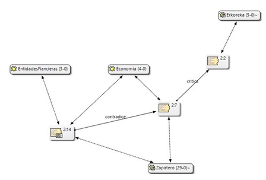
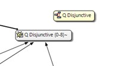
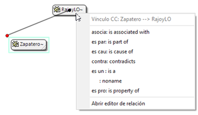
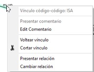

# Vistas de Red

Las Vistas de Red son uno de los componentes de ATLAS.ti que más atraen al usuario novel, al que le puede impresionar la posibilidad de realizar unos “bonitos dibujos” que muestren parte de su análisis. Sin embargo, la expectativa de generar diagramas para incluir en un informe o publicación —bonitos dibujos— nos llevaría a desaprovechar gran parte de lo que las vistas de red pueden aportar al proceso analítico. Además, si lo que nos interesan diagramas acabados, podemos hacerlos mejor con otros programas. Desde nuestro punto de vista, lo que es más relevante de las *vistas de red* es que son una representación gráfica *operable* de nuestro trabajo conceptual que nos permitirá pensar sobre nuestro análisis y realizar parte de nuestro trabajo conceptual.

Para aclarar lo que queremos decir, recurriremos de nuevo a Strauss y Corbin quienes hablan de los *diagramas* como “mecanismos visuales que dibujan las relaciones entre los conceptos.” (Strauss & Corbin, 2002, p. 236) y los sitúan al mismo nivel de importancia que los memorandos (los desarrollan de forma conjunta en el mismo capítulo). Strauss y Corbin plantean diferentes formas de diagramación (por ejemplo matrices) y a diferentes niveles, y la que más se asemeja a las *redes* en ATLAS.ti es la que vinculan con la codificación selectiva

(…) el mismo acto de hacer un diagrama integrador final le ayudará al analista a redondear las relaciones y a descubrir las fallas en la lógica. Al final, es importante tener una descripción clara y gráfica de la teoría, que sintetice los principales conceptos y sus conexiones. (Strauss & Corbin, 2002, p. 258)

Otros autores hacen planteamientos similares a los de Strauss y Corbin (Miles & Huberman, 1994; M. Patton, 2002; Vaismoradi, Turunen, & Bondas, 2013; Verdinelli & Scagnoli, 2013), pero desde nuestro punto de vista la propuesta que más se acerca a las *vistas de red* de ATLAS.ti es la que realiza Jennifer Attride-Stirling (2001), quien plantea las *redes temáticas* como, “web-like illustrations (networks) that summarize the main themes constituting a piece of text.” (p. 386). En la figura \ref{fig-attride} podemos ver un ejemplo de red temática en la que se están relacionando diferentes niveles de *temas*, y que si utilizamos “lenguaje” ATLAS.ti, podríamos interpretar como la representación de diferentes *códigos* (en la práctica, un *código* puede ser un tema).

Las *Redes* nos permitirán no sólo representar gráficamente las relaciones creadas entre los diferentes componentes que forman parte de la UH, sino que serán también un espacio donde podremos crear nuevas relaciones entre componentes^[En la práctica, la forma más fácil de crear relaciones entre elementos es desde el editor de *Vistas de Red*.] o incluso crear nuevos componentes (códigos, anotaciones y familias). Esto significa que podemos considerar a las *Redes* no sólo como el espacio para la representación del trabajo realizado, sino como un espacio para **desarrollar y refinar** dicho trabajo.

Ahora que quizás tenemos una idea más clara de qué son y de cuan importantes son las *redes*, veamos cómo podemos trabajar con ellas en ATLAS.ti.

## La pantalla de Vistas de Red

La pantalla de las *Vistas de Red* (figura \ref{fig-vista-red})tiene características similares a la pantalla principal del programa, en el sentido que es un espacio de trabajo con entidad propia. A continuación, pasaremos a describir sus principales zonas.

1) Como en el resto de pantallas, tenemos información sobre el título de la red.

2) Un conjunto de menús que permitirán realizar todas las acciones relacionadas con las redes.

3) Barra de iconos que ofrecen acceso a las funciones principales.

4) Espacio de visualización y edición en el que podremos representar cualquiera de los componentes de la UH (principalmente códigos, pero también citas, DPs y memos) y las relaciones entre ellos. En este espacio los diferentes componentes recibirán el nombre genérico de *nodos*, mientras que las relaciones entre ellos recibirán el nombre genérico de *vínculo*.

## Creación de Vistas de Red

Para la creación de las *Redes* podemos utilizar diferentes estrategias*.*

Podemos, por ejemplo, empezar a crear una *Red* partiendo “desde cero”, es decir, una red que de entrada no incluirá ningún nodo y en la que iremos incluyendo progresivamente nodos y relaciones. Otra estrategia consistiría en crear la *Red* a partir de información existente en nuestra UH, es decir, crear una red “focalizada” en algún elemento y que iremos completando y modificando.

Consideramos que la mejor estrategia es la segunda, pues dado que entendemos las *Redes* como la representación de un trabajo conceptual previo, entendemos que el punto de partida debe ser ese trabajo conceptual (que implica la existencia previa de nodos y relaciones) que podemos ir desarrollando y ampliando posteriormente en la *vista de red*.

## Redes vacías

Para la creación de una *red* de este tipo, utilizaremos la opción Redes &gt; Nueva vista de red de la pantalla principal de ATLAS.ti.

Se nos pedirá que demos un nombre a la nueva red y, a continuación se abrirá la pantalla principal de redes, en la que podremos ir añadiendo la información que consideremos oportuna (ver Importar Nodos, pág. 124). La forma de trabajar a partir de ese momento no es excesivamente diferente a como lo haríamos con una red focalizada, por lo que remitimos al lector al siguiente apartado.

## Redes focalizadas

La creación de una red focalizada implicará siempre la selección previa de algún elemento que se convertirá en el nodo inicial de la red. Los elementos a partir de los que podemos crear las redes focalizadas son prácticamente cualquiera de los que hemos creado anteriormente: DPs, citas, códigos y memos, pero también las familias.

Aunque existen otras posibilidades, la forma más fácil de creación es desde cualquiera de los *administradores*. En todos los que permiten la creación de redes focalizadas, encontramos un icono que, una vez seleccionado algún elemento, abrirá la pantalla de redes y lo representará en la misma.

En esa primera representación se incluirá el elemento seleccionado, el resto de elementos con los que tenga una relación directa, y las relaciones que existan entre los elementos representados.

Ilustraremos la forma de trabajo habitual representando la red *tipo de preguntas* de Rasiah (2010).

En primer lugar, seleccinamos el código *QuestionType* en el *administrador de códigos* y clicamos en el icono de *Vista de red*. Inmediatamente se abrirá una pantalla de red con la representación del código y los códigos con los que está relacionado: *Q Y/N*, *Q Disjunctive* y *Q Wh*. En la figura \ref{fig-question-primer} podemos ver cómo aparecen representadas las relaciones, en este caso del tipo *es un* que habíamos definido previamente.

En estos momentos lo que tenemos es la representación de un código y sus relaciones directas con otros códigos, pero podríamos expandir esta red para representar también las relaciones directas de esos otros códigos. Para ello, en primer lugar, lo que haremos será pedirle al programa que nos muestre, junto a la etiqueta de *código*, información sobre sus relaciones, para poder saber si están representadas. Haremos esto con la opción de menú Presentación &gt; Presentar etiqueta ampliada de código.

En la figura \ref{fig-etiqueta-ampliada} podemos ver cómo la etiqueta del código *Q Y/N* incluye la información del número de citas (1) y del número de relaciones con otros códigos (4). Dado que el número total de líneas que parten o llegan al nodo es sólo una, sabemos que sólo hay representada una de las cuatro relaciones de ese código, por lo que el siguiente paso que daremos será el de representarlas también.

Para representar las relaciones de un nodo presente en la red, tenemos que seleccionar el nodo y el menú Nodos &gt; Importar vecinos. El resultado de realizar esta operación sobre el código *Q Y/N* es el que podemos ver en la figura \ref{fig-question-vecinos}, se han importado los códigos relacionados con *Q Y/N* y al mismo tiempo se han representado las relaciones con ese código y con los otros previamente representados en la red con los que también tienen relaciones.

Dado que la visualización es algo confusa, lo siguiente que haremos es pedirle al programa que ajuste de forma automática la representación, con la opción de menú Diseño &gt; Diseño semántico. Esta opción representará los nodos en función de las características definidas previamente en el *editor de relaciones* (pág. 109)^[Una de las características de las relaciones es la “dirección de la relación”, que puede ser: de izquierda a derecha (y viceversa) o de arriba hacia abajo (y viceversa).]. Probablemente cuando tengamos representados un número mínimamente elevado de nodos será necesario también realizar algún ajuste manual de posición.

Realizaríamos esta misma operación para el resto de nodos, es decir, si el número de relaciones que indica la etiqueta es menor que el número de relaciones representadas, procederíamos a importar a sus *vecinos*. Evidentemente este proceso no siempre tenemos que llevarlo al límite, es decir, a intentar representar todas y cada una de las relaciones de todos los códigos, puesto que podría llegar un momento en que la representación incluiría demasiados códigos como para ser práctica^[En ese caso, puede ser conveniente proceder, como veremos más adelante, a crear una nueva red para representar el resto de nodos.].

El resultado final en nuestro caso es el que aparece en la figura \ref{fig-red-question}, una representación completa del modelo de Rasiah.

En el ejemplo que hemos visto hemos utilizado únicamente *códigos* como *nodos* de la red, pero evidentemente podemos crear también una red partiendo de una *cita*. En la figura \ref{fig-red-cita} vemos la red que hemos creado a partir de la cita 2:7. Al tratarse de una red focalizada en una cita, se representan automáticamente las citas y códigos con las que está relacionada. En nuestro ejemplo, sólo hemos expandido la red importando los *vecinos* de la cita 3:9 (el códgio *Erkoreka*)*,* y los de la cita 2:14 (el código *EntidadesFinancieras*). Una vez que tenemos representados estos elementos, podemos “leer” la red más o menos de la siguiente forma: el presidente *Zapatero* realiza dos afirmaciones sobre *Economía* que se contradicen entre sí (2:7 y 2:14), en una de ellas (2:7) está criticando algo expuesto (2:2) por el congresista *Erkoreka*.

### Importar Nodos

Tanto si partimos de una *red vacía* como si lo hacemos de una focalizada, puede que en algún momento deseemos añadir algún nodo que no esté vinculado con ninguno de los representados en ese momento (y por lo tanto no podemos utilizar la opción de *importar vecinos*). Podemos hacerlo de dos formas. La primera, consiste en utilizar la opción Nodos &gt; Importar nodos..., que abrirá una ventana como la de la figura \ref{fig-importar-nodos}, en la que podemos ver que podemos elegir, en la lista desplegable, el tipo de nodo que queremos importar. Una vez seleccionado el tipo, podemos seleccionar el/los nodos que queremos representar en la *red*. Podemos hacer exactamente lo mismo, importar nodos de cualquier tipo, arrastrándolos desde cualquiera de los *administradores*.

Al realizar la importación, aparecerá representado en la *red* únicamente el nodo seleccionado (no se importarán los posibles nodos con los que esté relacionado), aunque si el nodo que importamos tiene definida previamente alguna relación con algún nodo presente en la *red*, ésta quedará representada.

Como hemos visto en la \ref{fig-importar-nodos}, una de las opciones que tenemos es la de importar *Vistas de red*. Al seleccionar esta opción se importará como nodo la *red* que hayamos seleccionado, pero únicamente como nodo, no se importará la *red* como tal.

En la \ref{fig-importar-red} podemos ver un ejemplo en el que tenemos representado el códgio *Q Disjunctive*, que incluye ocho relaciones de las cuales sólo están representadas cuatro. En esta ocasión hemos decidido no continuar expandiendo en esa *vista de red* todas las relaciones de ese código, pero dada su relevancia hemos considerado necesario crear una nueva *red* focalizada en ese código. Una vez creada la nueva *Vista de red* *Q Disjunctive*, hemos importado el nodo como una forma de informarnos de que tenemos que explorar también esa red, y de llegar de una forma fácil a la misma haciendo clic con el botón derecho sobre el nodo y seleccionando Abrir red. Podríamos hacer algo similar haciendo clic sobre el código, pero mientras en el primer caso se abriría una *vista de red* existente (con las posibles ediciones que hayamos podido hacer en la misma), en el segundo se abriría una nueva vista de red en la que se representaría el código y sus relaciones.

Aún así, si en algún momento nos interesa incluir en una *red* los nodos ya representados en otra, podemos hacerlo con la opción Nodos &gt; Fusionar vista de red.

### Importar nodos que “co-ocurren”

En el capítulo Herramientas de exploración, en el apartado Concurrencias (pág.165) veremos que ATLAS.ti ofrece herramientas para explorar las *co-ocurrencias* de códigos, es decir, aquellos códigos que, sin haber sido relacionados explícitamente por parte del analista, tienen una relación en el sentido de que *co-ocuuren* en alguna cita. Estas *relaciones* las podemos visualizar en el margen derecho de la pantalla principal, puesto que veremos varios códigos relacionados con una misma cita (o con citas que se solapan entre sí), pero se trata de una forma muy simple de visualización, que no nos permite visualizar el conjunto de *co-ocurrencias* de un código. Como decíamos, más adelante veremos otras herramientas que nos pueden ayudar a ello, pero por el momento podemos “ver” también las *co-ocurrencias* en las *vistas de red*. Para ello, utilizaremos la opción Nodos &gt; Importar códigos co-ocurrentes.

Podríamos, por ejemplo, crear una *red* focalizada en el código *Zapatero* e importar sus co-ocurrencias, con lo que obtendríamos el conjunto de códigos que aparecen, en todos los DPs, junto al código *Zapatero.*

## Crear/Eliminar Nodos

Hasta el momento, hemos visto la forma de incluir en la *red* elementos ya existentes, pero si consideramos que las *vistas de red* no son un simple dibujo, sino una herramienta de trabajo, es lógico que también podamos crear algunos elementos directamente en ellas. Lo podemos hacer con la opción Nodos &gt; Nuevo nodo, que nos ofrecerá la opción de crear nuevos *códigos* y nuevas *memos*. En ambos casos se solicitará que nombremos el elemento creado y este aparecerá representado en la *red*. En el caso de los *memos* lo único que habremos creado de esta forma es la etiqueta de *memo*, por lo que es conveniente hacer clic con el botón derecho sobre el nodo para seleccionar la opción Editar Memo.

Aunque no aparezca como opción del menú, también podemos crear *citas* en la ventana de *redes*. En este caso, lo que haremos será, en la ventana principal de ATLAS.ti, seleccionar el fragmento de texto que queremos convertir en *cita* y arrastrarlo hasta la ventana de *redes*.

Insistimos que lo que hacemos en la ventana de redes es trabajo conceptual con las mismas características que el que podemos hacer en la ventana principal del programa. Por lo tanto, todo lo que hagamos en la ventana de redes quedará reflejado en la pantalla principal, es decir, en nuestra UH. Si creamos un código nuevo, este aparecerá en nuestro *administrador de códigos*, y lo mismo con el resto de elementos.

Esta advertencia es importante sobre todo si lo que hacemos, en vez de crear elementos, es eliminarlos, pues estos no sólo desaparecerán de la *vista de red*, sino que desaparecerán también de la UH.

Para eliminar un nodo, sólo hay que hacer clic sobre él con el botón derecho, y seleccionar la opción Borrar. Pero como decimos, esto lo eliminará **a todos los efectos** de la UH^[Y recordemos que el borrado de un elemento de la UH no puede deshacerse.]. Si lo que queremos es simplemente que no aparezca representado en la *red*, la opción que tenemos que seleccionar es Eliminar de la vista.

## Definir relaciones

Si podemos crear nodos, es lógico que también podamos crear relaciones en la misma *vista de red*, por ejemplo, cuando tenemos representados códigos que no están relacionados entre sí (porque son el resultado de utilizar las opciones de importar *vecinos* o *co-ocurrencias)*. Una vez que representamos los códigos en la *red* puede que veamos con más claridad la conveniencia de crear relaciones entre algunos de ellos que cuando trabajábamos en la pantalla principal (de forma “textual”)

La forma más fácil de crear las relaciones es seleccionar el nodo que queremos que sea el punto de partida de la relación. Como vemos en la figura \ref{fig-crear-relacion-origen}, en la esquina superior izquierda del nodo aparece un círculo rojo. Si situamos sobre él el cursor y lo arrastramos, veremos que se irá dibujando una línea que podemos desplazar hacia otros nodos (sin soltar el botón izquierdo del ratón). Si soltamos el botón del ratón sobre otro nodo, nos aparecerán, como podemos ver en la figura \ref{fig-crear-relacion-destino}, las opciones de creación de relación que habíamos visto anteriormente.

De la misma forma que con los *nodos*, las relaciones así creadas forman parte de la UH, y de la misma forma que con los *nodos*, si las eliminamos de la *vista de red* quedarán eliminadas de la UH^[Evidentemente esto ocurrirá con cualquier relación y con cualquier nodo, con los que hemos creado directamente en la red o con los que existían previamente.]. Pero a diferencia de los *nodos*, que podíamos *quitar de la vista*, las relaciones, si existen, no pueden no ser representadas (sería una distorsión de los datos).

Tenemos otras opciones de edición de las relaciones. En el caso de las no simétricas, podemos cambiar la dirección de la relación haciendo clic con el botón derecho del ratón sobre la etiqueta de la relación y seleccionando Voltear vínculo. En la figura \ref{fig-editar-relacion}, podemos ver que también podemos editar el comentario de la relación e incluso cambiar el tipo de relación.

## Otras acciones

Además ce crear nuevos nodos y relaciones, desde la pantalla de *redes* también podemos realizar un par de acciones más relacionadas con los códigos: crear nuevos códigos uniendo entre sí códigos existentes, y crear nuevas familias de códigos.

### Fusionar Códigos

Anteriormente (Fusionar códigos, pág. 86) habíamos visto la posibilidad de crear nuevos códigos fusionando códigos existentes. Esta misma acción la podemos realizar en la pantalla de redes de la siguiente forma:

1) En primer lugar, tenemos que seleccionar uno o varios códigos “origen”^[La selección múltiple puede realizarse haciendo clic en varios nodos mientras se mantiene pulsada la tecla "Ctrl" o bien, si la posición de los nodos lo permite, dibujando con el ratón un rectángulo que los englobe.]. En el ejemplo de la Ilustración, hemos decidido prescindir de los códigos *Ev Substantial* y *Ev Subtle*, pues consideramos que no es necesaria una codificación tan exhaustiva y queremos fusionarlos con el código *Ev Medium*. Los seleccionamos por lo tanto, como *códigos origen* (1 en la figura \ref{fig-red-fusionar-codigo}).

2) Una vez seleccionados los nodos, utilizaremos la opción de menú Nodos &gt; Fusionar códigos. Esto hará que aparezca una línea con punto de partida en los *códigos origen* que tenemos que dirigir hacia el *código destino* (2 en la figura \ref{fig-red-fusionar-codigo}).

Como vemos en (3) en la figura \ref{fig-red-fusionar-codigo}, los *códigos origen* desaparecerán (no sólo de la *red*, sino de la UH) y sus *citas* pasarán a formar parte del *código destino* que, como vemos, antes de la fusión tenía sólo una cita y tras la fusión tiene nueve. El código resultante incluirá, además, los comentarios de los códigos origen.

### Crear Familias

En el ejemplo anterior, en el que hemos utilizado los códigos relacionados con *Evasión*, vemos que teníamos una *jerarquía* de códigos, con diferentes niveles de evasión, relacionados con un código *Evasion*. Como hemos vistgo anteriormente, esta es una de las posibilidades que tenemos de agrupar códigos, la otra es la creación de *familias*. Si en este momento constatamos la necesidad de disponer, además de las relaciones existentes, de una *familia* para los distintos niveles de *Evasion*, podemos crearla seleccionando los cuatro *códigos* con los diferentes nivels y haciendo clic en la opción de menú Especiales &gt; Generar familia &gt; Crear familia de código. Se abrirá una nueva ventana para que demos nombre a la familia (se nos sugerirá como nombre el mismo que tenga la *red*) y al hacer clic en *Ok* se creará la *familia*.

Como habremos visto al seleccionar el menú, podemos realizar esta misma operación de creación de familias con *documentos primarios* y con *memos*.

## Visualización

El editor de *redes* ofrece diferentes opciones para modificar la forma en que se representarán los nodos y sus relaciones. Estas opciones están disponibles en el menú *Diseño* y en el menú *Presentación*. Dada la gran cantidad de opciones, no nos es posible describirlas aquí, por lo que nuevamente será el lector quien tendrá que explorarlas.

## Guardar

Una vez creada*,* podemos guardar la *red* utilizando la opción Red &gt; Guardar o Red &gt; Guardar como. En este último caso, o si se trata de una nueva red, se nos pedirá un nombre.

De la misma forma que hemos comentado en ocasiones anteriores, la etiqueta de la red debe ser descriptiva del contenido, pero no es necesario (ni conveniente) que sea excesivamente larga. Una vez más, la descripción amplia del contenido, junto con cualquier otra información que consideremos necesaria, podemos incluirla en un *comentario* utilizando la opción Red &gt; Editar Comentario*.*

Es importante tener en cuenta que al crear una *red* hemos hecho un cambio en la UH, y por lo tanto **también** será necesario guardar los cambios en la misma, pues en caso contrario la red desaparecerá.

Esta forma de guardar la *red*, como parte de la UH, evidentemente es necesaria para no perder nuestro trabajo, pero tenemos además la posibilidad de guardarla de forma externa como archivo gráfico, lo que posteriormente nos permitiría incluir la *red* en un informe para ilustrar de una forma gráfica nuestro trabajo conceptual. Utilizaremos para ello la opción de menú Red &gt; Guardar como archivo gráfico.

Aunque no sea excesivamente recomendable, otra forma de incluir una *red* en un informe consiste en utilizar la opción Red &gt; Copiar al portapapeles. Evidentemente, en ese caso lo que tendremos que hacer posteriormente es acceder al programa en el que queremos incluir la *red* y seleccionar la opción *pegar*. Si nuestro informe lo estamos realizando (como es lógico) con un programa de procesador de textos, puede que nos “asustemos” al comprobar que el resultado de *pegar* es una representación textual de la *red* como la que aparece en la figura \ref{fig-representacion-textual}.

Para insertar al *red* tal y como la vemos en ATLAS.ti, tendremos que utilizar la opción *Pegado especial* (o el equivalente según el programa de edición que estemos utilizando) y elegir, entre los formatos que se proponen, alguno gráfico, como por ejemplo *Mapa de bits independiente del dispositivo*.
