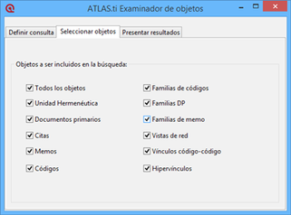
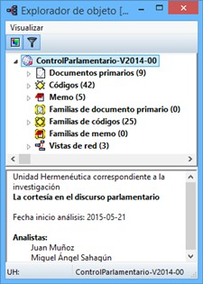
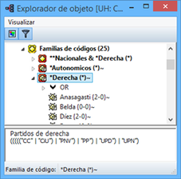
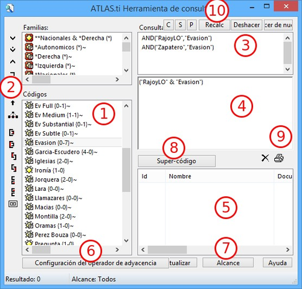
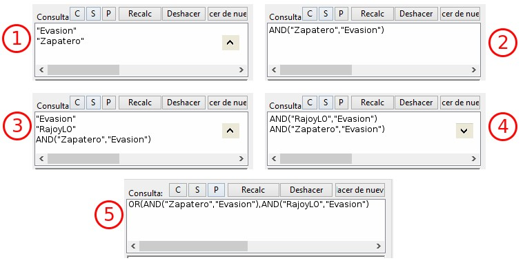
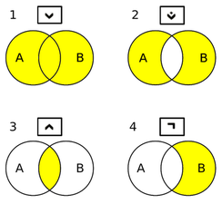
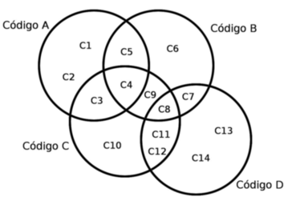
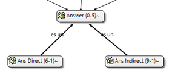
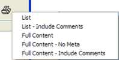

# Herramientas de exploración

En este capítulo describiremos algunas de las herramientas que podemos utilizar para explorar nuestra UH en busca de informaciones concretas. En primer lugar mostraremos la herramienta “simple” de búsqueda de texto en documentos, a continuación la forma de buscar texto en el conjunto de componentes de la UH (*Examinador de objetos*). Veremos también cómo podemos explorar el conjunto de objetos de la UH (*Bosque de códigos* y *Explorador de UH*). Dedicaremos también un amplio espacio a describir la *Herramienta de consulta* que nos permite recuperar citas que cumplen determinadas condiciones de codificación. Dedicaremos otro apartado a las herramientas de exploración de concurrencias (*Árbol de concurrencias* y *Tabla de concurrencias*). Para finalizar, veremos cómo podemos depurar posibles codificaciones redundantes (*Analizador de codificaciones*).

## Buscar texto

En el apartado dedicado a la autocodificación (pág. 78), hemos visto que ésta implicaba realizar una búsqueda de texto, y avanzábamos que esta función de ATLAS.ti va mucho más allá de las posibilidades a las que estamos acostumbrados habitualmente en los procesadores de texto. Tres son las características principales del sistema de búsqueda:

1. La búsqueda abarca el conjunto de documentos que componen la UH, y no únicamente el documento activo.

2. Pueden realizarse búsquedas de varios términos de forma simultánea.

3. Pueden utilizarse las sofisticadas opciones de la búsqueda con “expresiones regulares”.

Respecto a la primera característica no hay demasiado que comentar, por lo que después de describir de forma general la herramienta, explicaremos las características de las otras dos.

Activamos la herramienta con la opción Edición &gt; Buscar o con el icono lupa de la barra de herramientas de documentos (vertical).

La ventana que aparece (figura \ref{fig-herramienta-busqueda}) tiene las siguientes secciones:

1. Espacio para escritura (y almacenamiento) de la expresión de búsqueda.

2. Botones para ejecutar la búsqueda hacia adelante o hacia atrás.

3. Activar/desactivar la discriminación de mayúsculas/minúsculas en la búsqueda.

4. Activar/desactivar la modalidad de búsqueda GREP^[Acrónimo de “Global find Regular Expressions and Print”] (expresiones regulares).

5. Opciones de la búsqueda por categorías.

6. Barra de estatus. Indica el tipo de búsqueda activo.

### Búsqueda simple

Para realizar una búsqueda simple, lo único que tenemos que hacer es introducir en (1) la expresión de búsqueda^[Podemos utilizar el carácter especial “*” para indicar “cualquier carácter o caracteres. Si el asterisco va a continuación de la sentencia sería equivalente a indicar “todos los caracteres a continuación”, si la precede, el significado sería “todos los caracteres anteriores”.], decidir si queremos que la búsqueda diferencie entre mayúsculas y minúsculas (3) y hacer clic en (2) para ejecutar la búsqueda hacia adelante o hacia atrás. Una vez que se haya realizado la búsqueda en el documento activo, el programa nos preguntará si queremos continuarla en el resto de documentos de la UH (figura \ref{fig-continuar-busqueda}). Si contestamos que sí, se realizará la búsqueda en el resto de documentos, sin volver a pedirnos confirmación. Hay que tener en cuenta, que la búsqueda se habrá completado una vez que se haya realizado en el último documento de la UH, por lo que si hemos dado la orden de inicio de la búsqueda estando activo el documento P3, al llegar al último documento la búsqueda no continuará en los documentos P1 y P2.

### Búsqueda por categorías

La búsqueda por categorías implica la definición, en la sentencia de búsqueda, de un conjunto de términos diferentes que se buscarán de forma simultánea. Por lo tanto, podemos realizar búsquedas de un término cuya formulación concreta pueda variar en el texto (por ejemplo un término y sus sinónimos) o de conjuntos de términos que compartan alguna característica (para poner un ejemplo muy simple, podríamos buscar la aparición de “todos los artículos determinados” especificando en la búsqueda “el”, “la”, “los” y “las”).

En nuestro caso, podría interesarnos buscar todas las referencias que hacen los parlamentarios a terceros países, por lo que podríamos definir una búsqueda en la que se incluyeran Francia, Alemania, Inglaterra… de forma que la búsqueda fuera exitosa con la aparición de cualquiera de ellos en el texto.

Para ello, introduciremos en la zona de búsqueda los nombres de los diferentes países separados por una barra vertical |^[En la mayoría de los teclados, para introducimos este signo con la combinación de teclas AltGr”+1 (aunque este último carácter puede variar en función del teclado)]

Si cerramos la ventana de búsqueda y volvemos a abrirla, observaremos que sigue apareciendo la última sentencia de búsqueda que habíamos realizado, pero precedida por los caracteres TEMP:=

TEMP:=Francia|Alemania|Inglaterra

Si clicamos sobre la flecha ubicada a la derecha de la zona de escritura de la búsqueda, veremos además que, junto a esta, nos aparecen toda otra serie de búsquedas (predefinidas), todas ellas precedidas por algún término y los caracteres := (dos puntos y signo de igualdad). Estos caracteres son los que utilizamos para definir auténticas categorías de búsqueda, es decir, para definir un identificador para las búsquedas. Dado que no lo habíamos hecho previamente, el programa ha identificado nuestra búsqueda como “TEMP”, pero podemos cambiar esa etiqueta por otra más significativa, como por ejemplo EUROPA^[Si no cambiamos la etiqueta de la categoría, al realizar una nueva búsqueda, la anterior desaparecería de la lista, puesto que la nueva quedaría identificada igualmente como “TEMP”.]. De esta forma, nuestra sentencia de búsqueda sería

EUROPA:=Francia|Alemania|Inglaterra

A continuación, podríamos crear otra categoría en la que incluyéramos a países americanos, por ejemplo

AMERICA:=Estados Unidos|Canadá|México|Argentina

Con la primera categoría encontraremos referencias a países europeos, con la segunda, referencias a países americanos, pero ¿y si queremos realizar una búsqueda en la que se incluyan tanto países europeos como americanos? Evidentemente una posibilidad sería crear una categoría en la que se incluyan todos los países de las categorías anteriores, pero dado que ya tenemos las categorías “EUROPA” y “AMÉRICA”, podemos hacer una búsqueda en la que la sentencia incluya a ambas categorías. Para ello, podríamos escribir lo siguiente.

PAISES:=\$EUROPA|\$AMERICA

Como podemos observar, la que hemos hecho ha sido preceder el nombre de las categorías con el signo \$ , y por lo tanto el significado de la búsqueda sería “Busca todos los elementos incluidos en la categoría EUROPA y en la categoría AMERICA”.

De la misma forma que buscamos países, podría interesarnos hacer búsquedas para encontrar referencias a políticos de determinados partidos. En este caso podríamos proceder a crear categorías para los diferentes partidos:

BNG:=Jorquera|Pérez-Bouza

CC:=Oramas|Quintero

A continuación podríamos crear nuevas categorías para agrupar a los partidos en función de su ámbito terrirorial:

AUTONOMICO:= \$AMAIUR|\$BNG|\$CC|\$CiU|\$ERC|\$PNV|\$PSC|\$ICV| \$UPN

Y por último una categoría que englobara a todos los partidos (y por lo tanto a todos los políticos).

POLITICOS:=\$AUTONOMICO|\$ESTATAL

Hay que tener en cuenta que una vez que cerremos la sesión con Atlas, desaparecerán las categorías así definidas. Para poder utilizarlas durante más de una sesión hay que archivarlas mediante la opción *Guardar Categorías*, a la que podemos acceder con el botón *Opciones* de la ventana de búsqueda (figura \ref{fig-opciones-busqueda}). Atlas pedirá un nombre de archivo con el que salvar la lista, y sugerirá como nombre por defecto “SEARCHBIB.SKT”.

Podemos sobreescribir ese archivo o dar un nombre diferente, teniendo en cuenta que si lo sobreescribimos, la lista que acabamos de salvar será la que utilizará ATLAS.ti por defecto la próxima vez que utilicemos el programa. En el caso de dar un nombre de archivo diferente, para poder recuperar esa lista en futuras sesiones, tendremos que utilizar la opción *Cargar Categorías*. También podemos eliminar elementos de la lista de categorías con la opción *Borrar Categoría*^[Otra forma de modificar la lista de categorías es modificar directamente el fichero Srchbib.skt
(o crear otro fichero .skt) con un editor de texto.].

### Búsqueda GREP

Si la búsqueda por categorías permite la realización de búsquedas sofisticadas, la opción GREP aumenta todavía más las posibilidades de las mismas gracias a la posibilidad de la utilización de *expresiones regulares*.

Esta modalidad de búsqueda, implica utilizar caracteres “comodín” junto al texto de búsqueda, de una forma similar a la utilización del *comodín* \* (asterisco) en las búsquedas simples, pero permitiendo en este caso muchas más posibilidades que el “simple” “todo lo que venga a continuación”.

Aunque es muy probable que no necesitemos toda la potencia de la búsqueda GREP, no está de más saber de su existencia para poder consultar los operadores en el caso en que necesitemos una búsqueda especial. En la Tabla ofrecemos el listado de los operadores que hemos comprobado que funcionan en ATLAS.ti, y a continuación ilustraremos su utilización con algunos ejemplos.

| Operador                              | Función                                                                                                                                                                                                       |
|:--------------------------------------|:--------------------------------------------------------------------------------------------------------------------------------------------------------------------------------------------------------------|
| ^*término*                            | Limita la expresión de búsqueda que sigue al marcador al principio de la línea. Si se utiliza como el primer carácter dentro de una expresión entre paréntesis, excluye de la búsqueda el rango especificado. |
| *término*\$                           | Limita la expresión de búsqueda precedente al final de la línea.                                                                                                                                              |
| \\&lt;*término*                       | Limita la expresión de búsqueda siguiente al inicio de una palabra.                                                                                                                                           |
| *término*\\&gt;                       | Limita la expresión de búsqueda precedente al inicio de una palabra                                                                                                                                           |
| \\B                                   | Limita la expresión de búsqueda siguiente a NO incio de palabra                                                                                                                                               |
| \\B                                   | Limita la expresión de búsqueda precedente a NO final de palabra                                                                                                                                              |
| .                                     | Localiza cualquier carácter.                                                                                                                                                                                  |
| \\w                                   | Localiza cualquier carácter alfanumérico.                                                                                                                                                                     |
| \*                                    | Localiza cualquier cantidad (o su ausencia) de la expresión precedente.                                                                                                                                       |
| +                                     | Localiza al menos una ocurrencia de la expresión precedente.                                                                                                                                                  |
| ?                                     | Localiza cero o una ocurrencia de la expresión precedente.                                                                                                                                                    |
| \[ \]                                 | Localiza un rango de caracteres.                                                                                                                                                                              |
| (*término*       *término* *término*) | Localiza varios términos de forma simultánea.                                                                                                                                                                 |
| :d                                    | Localiza cualquier dígito.                                                                                                                                                                                    |
| \\                                    | Carácter utilizado cuando en la expresión se debe incluir uno de los caracteres especiales anteriores.                                                                                                        |
  : Operadores GREP

**Búsqueda al inicio de línea**

Anteriormente hemos realizado la autocodificación de las intervenciones de los participantes utilizando como criterio de búsqueda la etiqueta de participante. Comentábamos que para que el resultado sea correcto, el formato de las etiquetas debía ser lo suficientemente exclusivo como para no poder confundirse con el mismo texto apareciendo en otra parte del documento sin ser etiqueta de participante. Por ejemplo, si queremos autocodificar las intervenciones del Presidente, la etiqueta “Presidente” no sería válida, puesto que podemos encontrar la misma palabra en momentos en que otros participantes aludan al presidente. En nuestro caso esto no ocurre, puesto que la etiqueta de participante es “Presidente.-”, es decir, incluye los caracteres .- lo que hace altamente improbable que ese texto exacto esté presente en otras partes del documento.

¿Pero qué pasaría si nuestras etiquetas no cumplen esa característica? Evidentemente, si no hemos realizado previamente ningún trabajo de segmentación/codificación sobre el documento, la mejor alternativa es volver al archivo original para modificar las etiquetas y volver a realizar la asignación del documento. En caso contrario, podemos optar por una opción (quizás no óptima) consistente en considerar que la aparición del término “Presidente” al inicio de un párrafo probablemente será la etiqueta del participante. Por lo tanto, nuestra búsqueda GREP debería ser \^Presidente.

Si nuestros datos son entrevistas en las que han participado diferentes entrevistadores a los que hemos identificado etiquetas del tipo “Ent1:”, “Ent2:”, etc., y queremos autocodificar sus intervenciones de una forma genérica, con un único código “Entrevistador”, podemos utilizar otra combinación de expresiones.

Volveremos a utilizar el operador \^ seguido de “Ent” para especificar que la búsqueda sea al inicio de línea, y para que la búsqueda incluya el número de entrevistador utilizaremos el operador :d, es decir “cualquier carácter numérico”. Finalmente podemos incluir también el carácter : que forma parte del identificador de entrevistador, con lo que el resultado sería \^Ent:d: . Es decir, “localiza, al inicio de la línea, todas las ocurrencias de 'Ent1:, Ent2: Ent3:...”

**Búsqueda al inicio de palabra**

Otra posibilidad que tenemos es hacer búsquedas que funciones únicamente cuando el texto buscado se encuentra al inicio (o al final) de una palabra pero no si se encuentra en cualquier otra posición.

Imaginemos, por ejemplo, que queremos encontrar palabras que empiecen por "pre". Si hacemos una búsqueda normal (no GREP), obtendríamos como resultado tanto “presidente”, "precisión" y "presente" como "imprecisión", "impresionante" o "comprensión", en las que el término de búsqueda forma parte de la palabra aunque no al inicio.

Una forma de hacer esta búsqueda utilizando GREP es mediante el operador \\&gt;*término* (o también \\b*término*) de forma que la búsqueda sólo dará resultados si la ocurrencia es al inicio del término buscado

\\&lt;pre

\\bpre

Si lo que queremos es lo contrario, que la búsqueda sólo de resultado cuando el término aparece al final de palabra, podemos utilizar: *término*\\&gt; (o *término*\\b)

Así, si queremos encontrar palabra que acaben con "er" podríamos escribir cualquiera de las siguientes expresiones.

er\\&gt;

er\\b

**Búsqueda de palabras completas**

La búsqueda anterior sólo identificará la cadena exacta "er" (al final de palabra), es decir, encontraría “er” en la palabra “conceder”, pero el texto seleccionado sería sólo “er”, no la palabra completa.

conceder

Si queremos que identifique palabras completas acabadas en “er” podemos ayudarnos de otros dos operadores GREP

\\w = Cualquier carácter alfanumérico

\* = Una o más veces el carácter anterior

Una búsqueda con la combinación de estos dos operadores encontraría cualquier palabra completa, puesto que el significado de la expresión sería “busca la aparición de cualquier cantidad (asterisco) de caracteres alfanuméricos (\\w)”.

Si a continuación añadimos er\\&gt;, estaremos ampliando nuestra expresión para que identifique únicamente las palabras “acabados en 'er'”

\\w\*er\\&gt;

Para finalizar, podemos unir los operadores "inicio de palabra" y "fin de palabra" para encontrar palabras completas con un determinado inicio y un determinado final. Por ejemplo, la expresión

&lt;p\\w\*a\\&gt;

encontrará cualquier palabra que empiece con "p" y acabe con "a", puesto que:

&lt;p es sinónimo de "palabra que empiece con la letra p"

\\w\* es sinónimo de "cualquier carácter alfanumérico (\\w) de cualquier longitud (\*)"

a\\&gt; es sinónimo de "palabra que termine con "a"

**Búsqueda de varios términos de forma simultánea**

Ya que estamos buscando finales de palabra y hemos puesto como ejemplo la cadena "er" podríamos hacer una búsqueda de todas las palabras que terminan en "ar", "er" o "ir" con la siguiente expresión

(ar|er|ir)\\&gt;

en la que utilizamos el paréntesis para agrupar el conjunto de caracteres a los que se aplicará la función "final de palabra" y la barra vertical para indicar las diferentes búsquedas a las que debe aplicarse. En este caso, de nuevo, el resultado de la búsqueda será únicamente las cadenas "ar", "er" o "ir", por lo que si lo que queremos son palabras completas con esas finalizaciones sólo tenemos que utilizar de forma conjunta las dos expresiones anteriores

\\w\*(ar|er|ir)\\&gt;

Volviendo a la autocodificación de nuestros participantes, recordamos que la estrategia que habíamos utilizado era crear un código para cada uno de ellos, es decir, cada uno de los parlamentarios está asociado con un código. Aunque esta estrategia es correcta, podríamos haber decidido que no nos interesa qué persona en concreto es la que está interviniendo sino el partido político al que pertenece^[Lo que en nuestro caso habíamos hecho creando familias de participantes para cada uno de los partidos políticos.]. Esto significa que si queremos autocodificar las intervenciones de Josep Antoni Durán i Lleida, Pere Macias, Josep Sánchez i Llibre y Jordi Vilajoana, con el código “CiU” (en vez de un código diferente para cada uno de ellos). La expresión en este caso sería

\^Sr. (Duran|Macias|Sanchez|Vilajoana).-

El problema de la expresión precedente es que no identificaría los “Sra” cuando interviene una política, por lo que podemos añadir un operador más

\^Sra?. (Buenaventura|Erkoreka)

Dado que el operador ? significa “localiza cero o ninguna ocurrencia de la expresión precedente”, encontraría tanto “Sr” como “Sra”, pues a? implica que puede aparecer o no el carácter “a”.

**Búsqueda en el “interior” de una palabra**

Ahora ya sabemos encontrar palabras cuyo inicio o final sea uno o varios caracteres determinados, pero también podríamos querer buscar palabras que contengan unos determinados caracteres (pero no empiecen o terminen por).

En este caso, el comando GREP que utilizaremos será

\\BTérmino

De forma que si introducimos la siguiente expresión

\\Bdo

El resultado será todas las palabras que contengan (pero no comiencen) por "do", por ejemplo, encontrará "adocenar" pero no "doce". De todas formas, también encontraría aquellas cuya finalización sea "do", por ejemplo "cogido". Si queremos evitar esto, es decir, encontrar aquellas en las que la cadena se encuentre únicamente en el "interior" de una palabra, entonces la expresión que deberemos utilizar será \\Bdo\\B

## Búsqueda ampliada: Examinador de objetos

Como hemos visto, la herramienta de búsqueda se limita a búsquedas de texto en los DPs, pero podríamos necesitar realizar búsquedas más amplias que incluyan otros componentes de nuestra UH. Por ejemplo, podríamos necesitar realizar una búsqueda de texto en los comentarios de los objetos (citas, códigos...) o en las memos. En ese caso podemos utilizar la herramienta *Examinador de objetos*, que nos permitirá ampliar la búsqueda a cualquier contenido textual de la Unidad Hermenéutica. Estas búsquedas, además, podrán realizarse utilizando tanto la opción de “búsqueda por categorías” como la de “búsqueda GREP” descritas previamente.

Al activar la herramienta con la opción Herramientas &gt; Examinador de objetos, nos aparecerá la ventana que podemos ver en la figura \ref{fig-examinador-definicion}, que en la práctica está compuesta por tres secciones, puesto que son tres los pasos de la búsqueda.

En primer lugar (1) definiremos la sentencia de búsqueda, para a continuación seleccionar los objetos a los que se aplicará la misma (2). Finalmente, en (3) podremos ver los resultados.

En la sección *Definir consulta*, definiremos la búsqueda a realizar (4) y si queremos o no utilizar la sintaxis GREP (5)^[Podemos utilizar también la búsqueda por categorías.]. Finalmente seleccionaremos (6) el ámbito al que se aplicará la búsqueda, es decir, en qué secciones de los diversos componentes (nombre del componente, comentario...).

En el ejemplo de la Ilustración estamos realizando una búsqueda utilizando sintaxis GREP. En este caso, una búsqueda de las apariciones de diferentes modalidades de referencia a “falsedad”. Si hemos leído el apartado dedicado a la búsqueda GREP podemos traducir la expresión de búsqueda como “busca las apariciones de “fals” seguidas de cualquiera otros caracteres (utilizando la expresión GREP \\w\*. Por lo tanto, el resultado debería incluir términos como “falso”, “falsedad”, “falsos”, etc.

La segunda sección del *Examinador de objetos* (figura \ref{fig-examinador-seleccion}) nos permite seleccionar los objetos (componentes) a los que se aplicará la búsqueda^[*Unidad Hermenéutica* hace referencia al comentario de la *Unidad Hermenéutica*.]. Por lo tanto, si en la pantalla anterior hubiéramos seleccionado únicamente *Comentario* como ámbito de búsqueda y en esta otra seleccionamos todos los objetos, la búsqueda se realizaría únicamente en los comentarios de todos los objetos de la UH. Si el término apareciera por ejemplo en una cita (pero no en un comentario de cita), la búsqueda no lo incluiría.

La última sección de la herramienta nos muestra finalmente los resultados de la búsqueda. Como podemos ver en la figura \ref{fig-examinador-resultados}, la búsqueda ha dado como resultado 12 coincidencias, que incluyen anotaciones, códigos, documentos y citas. En la misma ilustración podemos ver cómo, al seleccionar uno de los resultados, en la parte inferior de la ventana podemos ver el contexto en el que se encuentra. En este caso, la palabra “falsedad” aparece en la memo *Mentira*.

## Exploración de objetos

Las búsquedas anteriores nos permiten encontrar determinada información textual en nuestra UH, es decir, explorar nuestros datos de una forma determinada. Otra forma de exploración que nos será muy práctica implica “navegar” por los objetos que hemos creado anteriormente.

Efectivamente, en las primeras fases de trabajo con nuestra UH podemos visualizar muy fácilmente el trabajo realizado, ya sea en el margen derecho de la pantalla, en el que visualizamos las citas, los códigos con los que están relacionadas, los hiperenlaces, etc., o también en los diferentes *administradores* (de documentos, citas, códigos y anotaciones). Pero como hemos visto anteriormente, hay determinadas informaciones que no es posible visualizar de esta forma, como por ejemplo las relaciones entre códigos (aunque disponemos del *administrador* *de relaciones*). También habíamos visto (pág. 108) que la herramienta *Árbol de códigos* es una ayuda para visualizar dichas relaciones. Una función similar nos ofrece el *Bosque de códigos*, al que podemos acceder mediante la opción Códigos &gt; Miscelánea &gt; Bosque de códigos. La única diferencia entre ambas es que mientras la primera nos muestra la estructura completa de los códigos existentes en la UH, la segunda nos muestra únicamente la del código seleccionado.

Por su parte, la herramienta *Explorador de UH*, a la que accedemos mediante el menú Herramientas &gt; Explorador de UH, incluye, además de la estructura de códigos, el resto de elementos de la UH, desde documentos primarios hasta vistas de *Red*. Esta herramienta, por lo tanto, nos permite una visualización completa de nuestra UH, y en algunos momentos será imprescindible para no perdernos entre el conjunto de elementos y relaciones creados.

Aparte del diferente ámbito al que se aplican (un código, códigos y UH), no existen otras diferencias entre las tres herramientas;, el funcionamiento de las mismas es similar, por lo que lo ilustraremos únicamente con el *Explorador de objetos*.

En la figura \ref{fig-explorador-UH} podemos observar cómo aparecen el conjunto de objetos de la UH (en los otros casos se mostrarían únicamente un código o el conjunto de códigos). A la izquierda de cada uno de ellos encontramos un signo + que permite desplegar la “rama” del objeto para mostrar sus relaciones. En el caso de los DPs, sus relaciones son las citas que incluyen, y para ellas los códigos con los que están relacionadas.

Si desplegamos la rama de códigos, la visualización será idéntica a la que podemos ver con el *Árbol de códigos* o con el *Bosque de códigos.* En el caso de las *familias*, podemos ver sus miembros y, en el caso de haber creado *superfamilias* podemos ver no sólo sus miembros sino también los operadores que han dado lugar a su creación. En el ejemplo de la figura \ref{fig-explorador-UH-familias}, podemos ver cómo la superfamilia Derecha tiene como miembros los códigos “Anasagasti”, “Belda”, etc,.. y que en su creación se ha utilizado el operador lógico OR.

Además de poder visualizar los diferentes objetos, podemos realizar acciones sobre los mismos, por ejemplo en la parte inferior de la ventana podemos editar o crear sus comentarios, mientras que si clicamos sobre un objeto con el botón derecho del ratón tendremos acceso a alguna de las acciones habituales sobre el mismo.

En la parte superior de la ventana encontramos también un menú que nos permite modificar algunas opciones de visualización, y unos iconos entre los que destaca el que permite seleccionar si queremos que la visualización de los objetos quede afectada o no por los filtros que se hayan aplicado previamente.

## Herramienta de consulta

Desde nuestro punto de vista, la herramienta más potente del programa es la *Herramienta de consulta*, la herramienta que nos permite realizar consultas sofisticadas de nuestros datos, que nos permite interrogar a nuestros datos para que nos muestre las citas que cumplen determinadas condiciones. Por lo tanto, con la *Consulta* lo que obtendremos siempre será única y exclusivamente citas. Más concretamente las **citas que cumplen la condición de estar codificadas de una forma determinada**, lo que implica que esta herramienta está directamente relacionada con nuestro sistema de codificación y por lo tanto con el trabajo previo del analista. La *Consulta* no nos ofrecerá ningún resultado, ninguna cita, que no haya sido previamente codificada.

Una posible consulta podría ser algo del tipo: “muéstrame todas las citas que están codificadas como... y al mismo tiempo como... O “muéstrame todas las citas que están codificadas como... pero no como...”.

En el apartado dedicado a la autocodificación (pág. 78) vimos cómo habíamos codificado las intervenciones de cada uno de los participantes y que posteriormente habíamos creado familias en las que agrupábamos a los participantes en función de su adscripción política. Tenemos por lo tanto una serie de códigos que podremos utilizar para realizar consultas en las que veamos las posibles diferencias en el discurso en función del partido político.

Nos podría interesar, por ejemplo, comparar las características de las respuestas evasivas del presidente Zapatero y del presidente Rajoy. Puesto que tenemos los códigos *Zapatero*, *RajoyPR* y *Evasión*, podríamos realizar una consulta para solicitar las “citas codificadas como *Evasión* y al mismo tiempo como *Zapatero*” y otra para solicitar las “citas codificadas como *Evasión* y al mismo tiempo como *RajoyPR*”. Una vez que tenemos los resultados de ambas consultas (podríamos generar un informe impreso de cada una de ellas), podemos proceder a comparar las posibles similitudes y/o diferencias de ambos discursos.

Las consultas nos permitirán por lo tanto un nuevo nivel de análisis de nuestros datos y serán, entre otras cosas, una importante ayuda en nuestra tarea de “comparación constante”.

Una consulta consistirá siempre en la combinación de uno o más *operandos* con un *operador*, donde los operandos son los códigos y familias de códigos y los operadores las condiciones que deben cumplirse para obtener un resultado. En el ejemplo anterior, para identificar las citas codificadas como *Zapatero* y al mismo tiempo *Evasion,* los operandos serían “Zapatero” y “Evasión” y el operador la condición Y.

### La pantalla de Consulta

Podemos acceder a la *Herramienta de consulta* utilizando el icono “Prismático” de la barra de herramientas vertical o desde el menú Análisis &gt; Herramienta de consulta. A continuación analizaremos la compleja ventana que nos aparece ( figura \ref{fig-herramienta-consulta}).

1) Códigos y Familias de Códigos^[En el resto de esta sección nos referiremos a ellos como *operandos*.] existentes en la UH. Como decíamos, son los *Operandos* que utilizaremos en la definición de la *consulta*. La activación de los operandos para su inclusión en la consulta se realiza haciendo clic dos veces sobre ellos^[Para la definición de la consulta no necesitamos escribir nada, todo el trabajo lo realizaremos haciendo clic sobre operandos y operadores.], lo que hará que en la ventana de resultados (5) aparezcan las citas relacionadas. Aunque en principio una consulta tiene que incluir operandos y operadores, simplemente seleccionando un operando veremos sus citas (si las tiene) en la zona de resultados. A medida que vayamos añadiendo más operandos y operadores, la zona de resultados cambiará para reflejar los cambios.

2) Condiciones a utilizar como operadores. Están agrupadas en tres categorías: Operadores *booleanos*, operadores *semánticos* y operadores de *proximidad*. De nuevo, para seleccionar un operador sólo tenemos que hacer clic sobre el icono correspondiente.

3) Conjunto de las expresiones formuladas, es decir, conjunto de combinaciones de operandos y operadores. Cada línea visualizada en esta zona genera un resultado. Como podemos ver ( Ilustración), hemos realizado dos consultas, la primera para citas que cumplan la condición de estar codificadas como Zapatero Y Evasión, y la segunda para las codificadas como RajoyLO Y Evasión.

4) Esta zona es similar a la anterior, pero utiliza una *sintaxis* diferente para visualizar las condiciones utilizadas. Como podemos ver, lo que se nos muestra es la última consulta realizada. Si en el paso anterior, tras las consultas ya realizadas hubiéramos clicado en el operador O, se nos mostraría el resultado de esa consulta:

5) Resultados, citas que cumplen las condiciones de la última *consulta* definida (la que se visualiza en (3)).

6) Posibilidad de seleccionar (para los operadores de distancia) la distancia máxima que debe separar a dos citas (y el tipo de unidad de media: párrafos...) para que sean incluidas en los resultados.

7) Acceso a una nueva ventana (*Alcance de consulta*, ver figura \ref{fig-herramienta-consulta-alcance}) para seleccionar los documentos a los que se aplicará la consulta*.* En este caso los operandos serán documentos y familias de documentos y los operadores sólo los booleanos.

8) Convierte los resultados de la *consulta* en una *Super-código* (ver pág. 162).

9) Conjunto de iconos que permiten eliminar una cita de la lista de resultados (no se borra la cita, sólo se la hace desaparecer de esta lista) o imprimir la lista de resultados.

10) Opciones de edición de las expresiones

 C = Borra todas las expresiones introducidas previamente.

 S = Invierte el orden de los dos últimos operandos.

 P = Duplica el último operando introducido.

 Recalc = Vuelve a calcular la *consulta* después de hacer cambios en la selección de documentos (7 en la ilustración anterior) o en la distancia (6 en la ilustración anterior).

 Deshacer = Deshace la última acción.

 Hacer de nuevo = Rehace la última acción.

### Sintaxis

Probablemente una dificultad con la que nos encontraremos al crear la consulta tenga que ver con el hecho de que su definición se realiza utilizando la *Notación Polaca Inversa*.

“La *Notación Polaca Inversa*, notación de postfijo, o notación posfija, (en inglés, *Reverse polish notation*, o RPN), es un método algebraico alternativo de introducción de datos. Su nombre viene por analogía con la relacionada notación polaca, una notación de prefijo introducida en 1920 por el matemático polaco Jan Lukasiewicz, en donde cada operador está antes de sus operandos. En la notación polaca inversa es al revés, primero están los operandos y después viene el operador que va a realizar los cálculos sobre ellos. Tanto la notación polaca como la notación polaca inversa no necesitan usar paréntesis para indicar el orden de las operaciones mientras la aridad del operador sea fija.” («Notación polaca inversa», 2015)

Esto significa que, si habitualmente una suma la escribiríamos 4 + 5, donde 4 y 5 son los operandos y el signo + es el operador, al utilizar la RPN tenemos que escribir en primer lugar los operandos y a continuación el operador, es decir, 4 5 +.

Volviendo a nuesto ejemplo, en vez de Zapatero Y Evasion, tendríamos que escribir Zapatero Evasion AND^[Como comentábamos, en esta herramienta no escribimos, sino que clicamos, por lo que cuando en este apartado hagamos referencia a “escribir”, el significado real es realizar diversas combinaciones de clics sobre operandos y operadores.].

En el caso de que quisiéramos obtener como resultado todas las citas del código *Evasion* en las intervenciones de cualquiera de los presidentes (Zapatero o Rajoy) tendríamos que añadir alguna condición más a nuestra consulta. Tendríamos que realizar una consulta para obtener las citas de cada uno de los presidentes y posteriormente combinar los resultados con una condición O. Para ello, con una “sintaxis clásica” habríamos utilizado paréntesis para definir la prioridad de las operaciones. Pero como veíamos en la cita anterior, otra de las características de la RPN es que no utiliza paréntesis, por lo que tendríamos que formular la consulta de la siguiente forma:

\(1) Zapatero RajoyLO OR

\(2) Evasion

\(3) AND

Aunque la formulación pueda parecer extraña, en la práctica es relativamente sencilla si tenemos en cuenta que cada vez que obtenemos un resultado en una consulta ese resultado pasa a convertirse en un operando. Es decir, una vez que hemos obtenido las citas correspondientes a la primera parte de la consulta (1) éstas se convierten en un operando, lo mismo que las de (2), por lo que una vez que tenemos dos operandos los combinamos con el operador OR en (3).

También nos puede ayudar tener en cuenta que cuando escribimos la consulta en el programa, cada una de las líneas que aparecen en la zona 3 de la Ilustración es un operando, por lo que una consulta implicará combinar dos líneas (operandos) con un operador^[Aunque esto no es exactamente así, puesto que no todas las consultas requieren de dos operandos.]. En la Ilustración podemos ver el proceso de escritura. En (1) hemos introducido los dos primeros operandos (códigos), que hemos combinado con el operador AND. En (2) tendríamos por lo tanto el resultado de la consulta, que a su vez será un operando. En (3) hemos vuelto a introducir dos operandos (códigos) que de nuevo hemos combinado con el operador AND (que afecta sólo a las dos primeras líneas que vemos en la ilustración), por lo que tenemos (en 4) el resultado de esa consulta en la primera línea, y el resultado de la anterior en la segunda. Al combinar ambos operandos con el operador OR, nos dará el resultado que podemos ver (5), es decir, “Todas las intervenciones del presidente Zapatero o del líder de la oposición Rajoy, que han sido codificadas como *Evasion*”.

### Operadores

Para ilustrar la sintaxis de la *Consulta* hemos utilizado los operadores AND y OR, que junto a XOR y NOT forman parte de la categoría de operadores booleanos. Junto a estos, disponemos de otros dos conjuntos de operadores, los semánticos y los de proximidad. A continuación procederemos a explicar las características de cada uno de ellos.

#### Operadores booleanos

En la Tabla podemos ver la descripción de los operadores booleanos.

| Operador | Sintaxis  | Función                                                                                |
|:--------:|:---------:|:---------------------------------------------------------------------------------------|
|    OR    | *A B* OR  | Selecciona las citas presentes en el operando A o en el operando B                     |
|   XOR    | *A B* XOR | Selecciona las citas presentes únicamente en A o en B (Y no las citas comunes a A y B) |
|   AND    | *A B* AND | Selecciona las citas presentes en A y en B                                             |
|   NOT    |  NOT *A*  | Selecciona las citas no presentes en A                                                 |
  : Operadores booleanos

A continuación utilizaremos diagramas de Venn para ilustrar gráficamente los resultados de cada uno de los operadores. En los diagramas, cada uno de los conjuntos (círculos) equivaldría a un operando (código o familia de códigos), y las zonas sombreadas serán el equivalente al resultado obtenido, es decir, a las citas que serían recuperadas. En la figura \ref{fig-venn-booleanos} tenemos el primer ejemplo con los operadores booleanos.

En (1) tenemos el resultado de la aplicación del operador OR, que implica la selección de todas las citas que están codificadas como A o codificadas como B. Por lo tanto se trata de un operador inclusivo, El operador XOR (O exclusivo) seleccionar igualmente las citas que están codificadas como A o como B pero no aquellas que están codificadas como A y al mismo tiempo como B, por lo que quedarían fuera las de la intersección de ambos conjuntos (2). En (3) vemos el operador más exclusivo, AND, puesto que en este caso sólo quedarán seleccionadas aquellas que están codificadas al mismo tiempo de una forma y de otra. En (4) tenemos el resultado de A NOT, es decir, todas aquellas citas que no están codificadas como A.

En la figura \ref{fig-diagrama-1} podemos ver la representación del ejemplo anterior en el que queríamos obtener “Todas las intervenciones del presidente Zapatero o del líder de la oposición Rajoy, que han sido codificadas como *Evasion*”,

Imaginemos ahora una situación como la representada en la figura \ref{fig-venn-ejemplo}, en la que el diagrama de Venn representa cuatro códigos que incluyen un total de catorce citas distribuidas de la siguiente forma:

Ahora podemos ver fácilmente el resultado (citas) de diferentes consultas

| Queremos obtener...                                  | Sentencia                 | Resultado                          |
|:-----------------------------------------------------|:--------------------------|:-----------------------------------|
| Citas codificadas como A o como B                    | Código-A \ Código-B  \ OR | C1, C2, C3, C4, C5, C6, C7, C8, C9 |
| Citas codificadas como A o como B pero no como A y B | Código-A  Código-B XOR    | C1, C2, C3, C6, C7, C8, C9         |
| Citas codificadas como A y como B                    | Código-A  Código-B Y      | C4, C5                             |
| Citas no codificadas como C                          | Código-C  NOT             | C1, C2, C5, C6, C7, C13, C14       |

Podemos ir “apilando” los resultados de las consultas para definir otras más complejas. Imaginemos por ejemplo que nos interesa obtener las citas que están codificadas con el Código-A o con el Código-B pero no con el Código-C. El resultado debería ser el que vemos en el diagrama de Venn de la figura \ref{fig-venn-consulta-multiple}.

Y la forma de realizarla sería como vemos en la siguiente tabla.

#### Operadores Semánticos

Como hemos visto, las *consultas* con operadores booleanos, sólo requieren de la existencia de códigos. En el caso de los operadores semánticos necesitamos además haber creado previamente relaciones entre códigos. Más concretamente, los operadores semánticos se basan en la existencia de relaciones de tipo transitivo entre códigos^[En las relaciones predefinidas: “Is part of”, “Is cause of” y “Is a”.] (ver Editar relaciones, pág. 109).

| Operador | Función                                                                                                                                                                                                    |
|:---------|:-----------------------------------------------------------------------------------------------------------------------------------------------------------------------------------------------------------|
| Down     | Selecciona las citas relacionadas con el código y con cualquiera de sus subtérminos, (descendientes) \ es decir, aquellos otros códigos con los que se ha establecido una relación                         |
| Up       | Recupera las citas relacionadas con el código y sus superiores directos (sólo un nivel)                                                                                                                    |
| Siblings | Recupera las citas relacionadas con el código, con sus descendientes directos (hijos) y los subtérminos directos de un código superior (hijos). No recupera las relacionadas con el nivel superior (padre) |
  : Operadores semánticos

Como también comentábamos, ATLAS.ti, a diferencia de otros programas, no permite crear jerarquías de códigos, pero sí nos permite crear estructuras de codificación gracias a la creación de relaciones entre códigos. Anteriormente habíamos creado (a través de la definición de relaciones del tipo is a y de is cause of) una jerarquía de códigos para reproducir la clasificación de tipos de respuestas de Rasiah (2010). Si disponemos de esta estructura definida previa a la asignación de citas a códigos, nuestra estrategia de codificación implicará codificar única y exclusivamente los códigos del nivel inferior en la jerarquía: *Ans Direct*, *Ans Indirect*, *Ev Full*, *Ev Substantial*, etc. El resto de códigos en la estructura (*Answer*, *Evasion*...) serán códigos libres, sin citas asociadas, pero aún así podremos, con la utilización de los operadores semánticos, obtener el conjunto de citas relacionadas con cualquiera de los códigos que se encuentran en niveles superiores de la estructura. Si *Ans Direct* tiene 6 citas y *Ans Indirect* tiene 9 citas, dado que ambas son un tipo de *Answer*, aunque este código tenga cero citas parece lógico pensar que en realidad tenemos 15 citas relacionadas con *Answer*. Igualmente, si sumamos el conjunto de citas de los códigos vinculados con *Evasion*, aunque *Evasion* tiene cero citas, en realidad tenemos 93 citas con modalidades de evasión.

Para obtener esos resultados utilizaremos el operador DOWN, por lo tanto:

Todas las citas por debajo de Answer: Answer DOWN

Todas las citas por debajo de Evasion: Evasion DOWN

En la figura \ref{fig-red-answer} podemos ver la *vista de red* de los códigos Answer DOWN*.* Dado que *Ans Direct* tiene 6 citas y *Ans Indirect* tiene 9, el resultado de Answer DOWN será de 15 citas (si no hay ninguna que esté en ambos códigos).

Por supuesto, podemos combinar los operadores semánticos con los otros tipos de operadores (booleanos y de proximidad). En un ejemplo anterior construíamos una consulta para identificar todas las citas de intervenciones de los presidentes Zapatero y Rajoy codificadas como Evasion.

\(1) Zapatero Evasion AND

\(2) RajoyPR Evasion AND

\(3) OR

Pero dado que nuestro código *Evasion* en realidad es un código libre, el resultado de esa consulta será de cero citas. Como hemos visto, tendremos que realizarla de nuevo incluyendo el operador DOWN

\(1) Zapatero

\(2) Evasion DOWN

\(3) AND

\(4) RajoyLO

\(5) Evasion DOWN

\(6) AND

\(7) OR

Aunque parezca una consulta muy compleja en realidad es simple, puesto que en (1) introducimos un operando, en (2) un operando y un operador, lo que nos da un resultado y por lo tanto ese resultado se convierte en un segundo operando; en (3) combinamos los dos operandos anteriores con un nuevo operador. Los tres comandos siguientes realizan la misma acción para el presidente Rajoy, y en (7) combinamos ambos resultados con el operador OR

#### Operadores de Proximidad

Por último, los operadores de proximidad, como su nombre indica, permiten recuperar citas en función de la relación espacial existente entre diferentes códigos ( Tabla).

| Operador      | Función                                                                                                               |
|:--------------|:----------------------------------------------------------------------------------------------------------------------|
| Within        | La cita codificada como Código-D está Within la cita codificada como Código-B\ Código-D Código-B Within               |
| Encloses      | La cita codificada como Código-B encloses la cita codificada como Código-D\ Código-B Código-D Within                  |
| Overlapped by | La cita codificada como Código-A está overlapped by la cita codificada como Código-C\ Código-A Código-C overlapped by |

La cita codificada como Código-C está overlapped by la cita codificada como Código-B\ Código-C Código-B overlapped by
Overlapps  | La cita codificada como Código-C overlaps la cita codificada como Código-A\ Código-C Código-A overlaps

La cita codificada como Código-B overlaps la cita codificada como Código-C\ Código-B Código-C overlaps  
Follows| La cita codificada como Código-B follows la cita codificada como Código-A \ Código-B Código-A follows
Precedes| La cita codificada como Código-A precedes la cita codificada como Código-B

Código-A Código-B precedes
  : Operadores de proximidad

En la figura \ref{fig-ilustracion-proximidad} hemos simulado una hipotética codificación que nos permitirá ilustrar cómo funcionan estos operadores.

Como vemos, el operador *Cooccur* es una combinación de varios de los operadores de proximidad (todos menos *Follows* y *Precedes*), por lo que en muchas ocasiones podremos utilizarlo en vez de alguno de los otros. Además, probablemente sea conveniente su utilización en vez del operador booleano AND. Efectivamente, el operador AND es altamente selectivo, puesto que implica que Código-A Código-B AND sólo obtendrá resultados cuando una cita está vinculada con ambos códigos.

Volviendo una vez más a nuestro ejemplo, en la figura \ref{fig-concurrencia-citas} podemos ver cómo en un mismo párrafo tenemos una cita (barra gris) codificada como *Zapatero* (resultado de la autocodificación original) y otra cita (resaltada) codificada como *Ev Medium*, se trata por lo tanto de una intervención del presidente Zapatero que hemos codificado como respuesta evasiva. Sin embargo, en una consulta como la que habíamos realizado previamente, utilizando el operador AND no aparecería esta cita, puesto que la cita codificada como *Ev Medium* no está codificada al mismo tiempo como *Zapatero*. Por lo tanto, para poder recuperar citas que tengan estas características debemos utilizar el operador *Cooccur* (aunque en este ejemplo también funcionaría *Within*).

Por lo tanto, nuestra consulta debería ser.

\(1) Evasion DOWN

\(2) Zapatero

\(3) Cooccur

Para finalizar con esta sección de operadores de proximidad, pondremos otro ejemplo para ilustrar los operadores *Follows* y *Precedes*. Estos operadores nos permitirán contestar a la pregunta ¿en qué ocasiones se ha hecho referencia al tema X a continuación (o antes de) el tema Y? Es decir, ¿qué citas hemos codificado como X a continuación de citas codificadas como Y?

En el modelo de Rasiah (2010) que hemos utilizado para codificar las respuestas evasivas, estas, al igual que las respuestas (*Answer*) y las respuestas intermedias (*A Intermediate*) podían ser consecuencia de tres modalidades de pregunta (*Q Y/N*, *Q Wh* y *Q Disjunctive*). Nos puede interesar, por lo tanto, identificar citas codificadas como *Evasion* que aparecen única y exclusivamente a continuación de citas codificadas como *Q Y/N* (preguntas de tipo Sí/No). En ese caso la consulta anterior quedaría de la siguiente forma:

\(1) Evasion DOWN

\(2) Zapatero

\(3) Cooccur

\(4) Q Y/N

\(5) Follows

### Super Códigos

En el apartado dedicado a las familias veíamos la posibilidad de crear un nuevo objeto, las *superfamilias* (de documentos, códigos o memos) utilizando un editor de consultas simplificado con respecto al que estamos viendo en esta sección. Ahora, a partir de las consultas que venimos realizando, podemos crear un nuevo objeto, los *supercódigos*, haciendo clic en el icono *Super-códgio*. La característica peculiar de estos códigos es que su contenido (citas) será el resultado dinámico de la consulta a partir de la que se hayan construido y que por lo tanto son la forma práctica de “guardar” consultas (no existe ninguna otra, si queremos guardar una consulta tenemos que crear un *supercódigo*). El significado de “resultado dinámico” es que, en tanto que son una consulta guardada, cualquier cambio en la UH que afecte a la consulta quedará registrado en el *supercódigo*. Es decir, imaginemos que nuestro código *Ans Direct* incluye 12 citas y nuestro código *Ans Indirect* 14 citas; la consulta *Answer SUB* nos dará un resultado de 26 citas, por lo que si creamos un *supercódigo* a partir de esta consulta este contendrá las mismas 26 citas. Si posteriormente a la creación del *supercódigo* añadimos dos citas más al código *Ans Direct*, el *supercódigo* las incorporará automáticamente^[Podemos crear una “vista fija” de un supercódigo con la opción Códigos > Miscelánea > Crear instantánea , que creará un nuevo código con la misma etiqueta a la que añadirá “[SN 1]” y que mantendrá fijo el número de citas que tenía el supercódigo en el momento de la creación.de este nuevo código.].

Teóricamente es posible modificar las características de un *supercódigo*, es decir, modificar la consulta a partir de la que se ha creado, por ejemplo, en el caso anterior, podríamos decidir añadir un nuevo tipo de *Answer* creando un código *Ans Intermediate*, por lo que la consulta Answer SUB debería incluirlo también. Para ello podríamos utilizar la opción Códigos &gt; Miscelánea &gt; Editar consulta, aunque dada la complejidad de la sintaxis de edición prácticamente es preferible volver a crear el *supercódigo* desde el inicio (rehaciendo la *consulta*). Una prueba de dicha dificultad es que, por ejemplo, la *consulta* Evasion SUB queda representada, en el editor de consultas como d(c(Evasion!)).

Por lo demás, se trata de códigos con las mismas características que el resto, es decir, pueden relacionarse con otros códigos y con anotaciones y pueden incluirse en las vistas de red, aunque no podemos incluir citas en ellas siguiendo el procedimiento habitual.

Para consultas simples en las que únicamente queremos combinar códigos utilizando el operador OR (Código-A Código-B OR) no es necesario utilizar la *Herramienta de consulta*. Podemos hacerlo directamente desde el administrador (o el menú) de códigos seleccionando varios códigos y eligiendo la opción Miscelánea &gt; Crear super código.

### Selección de documentos

Si utilizamos la *consulta* tal y como la hemos descrito, ésta dará como resultado las citas, que cumplan las condiciones especificadas en toda la UH. Pero nos puede interesar que el resultado haga referencia sólo a determinados DPs. Podemos utilizar esta opción, por ejemplo, si nos interesa obtener las citas relacionadas con un código determinado, pero sólo en los DPs que hemos agrupado en la *familia* *Legisltura IX.*

Para la selección de documentos, en la ventana de la *Herramienta de consulta* haremos clic en el botón *Alcance*, lo que nos abrirá una nueva ventana, similar a la principal de consultas, como la que podemos ver en la figura \ref{fig-consultas-alcance}. En este caso los operandos son tanto los documentos como las familias de documentos y los operadores únicamente los booleanos.

!Consultas: Alcance[\label{fig-consultas-alcance}](images/image-153.png)

Si creamos un supercódigo a partir de una *Consulta* en la que hemos realizado una selección de documentos, esta selección no afectará al supercódigo, que incluirá las citas que cumplan la condición especificada en el conjunto de DPs de la UH.

### Otras opciones

Otras posibilidades que nos ofrece la herramienta es obtener información adicional sobre los objetos que aparecen en ella: familias, códigos y citas (los resultados de la consulta). Podemos acceder a esas informaciones desde el menú contextual (haciendo clic con el botón derecho del ratón) sobre alguno de esos elementos.

En la figura \ref{fig-informacion-consultas} podemos ver las informaciones disponibles para códigos, citas y familias de códigos.

## Concurrencias

Más arriba hemos ilustrado el concepto de *concurrencia*, y hemos visto que podemos realizar consultas utilizando el operador *cooccur* para recuperar citas que cumplan la condición de estar codificadas de forma coocurrente con varios códigos. En esta sección veremos dos herramientas adicionales que permiten seguir explorando las concurrencias.

### Árbol de concurrencias

El árbol de concurrencias es una herramienta similar a los otros “árboles” que hemos visto en el apartado Exploración de objetos (pág. 145), pues nos muestra una estructura jerarquizada de objetos que podemos ir desplegando para llegar hasta cierto nivel de detalle. Las dos ramas principales de objetos son los códigos y los documentos primarios . En el caso de los códigos (figura \ref{fig-explorador-concurrencias} izquierda) visualizamos el conjunto de códigos de la UH y, en aquellos casos en que se produce concurrencias podemos desplegar la rama del código para visualizar con qué códigos se produce dicha concurrencia y finalmente en qué citas concretas. En el caso de los DPs, la expansión de la rama de documento nos mostrará una visualización idéntica a la anterior, con la única diferencia de que en este caso no visualizamos los códigos del conjunto de la UH, sino únicamente aquellos en los que se producen concurrencias para el documento seleccionado. (figura \ref{fig-explorador-concurrencias} derecha)

### Tabla de concurrencias

La otra herramienta que nos ofrece información sobre las concurrencias es la que podemos ver en la Ilustración. La *Tabla de concurrencias* nos permite visualizar de una forma mucho más eficaz los casos de códigos que tienen concurrencias de citas, puesto que nos permite literalmente construir una tabla de doble entrada donde las filas y las columnas son códigos y las celdas nos informan de la cantidad de citas que coocurren en esos códigos.

En la figura \ref{fig-tabla-concurrencias}, en (1) y (2) se nos muestran el conjunto de códigos de la UH, para que podamos seleccionar aquellos que queremos incluir en la tabla como columnas (1) y como filas. En este caso la zona de códigos de filas está vacía puesto que los hemos incluído todos en nuestra tabla. En (3) y (4) aparecen los códigos que hemos seleccionado para columnas y filas. Como podemos ver, hemos seleccionado en columnas los códigos que hacen referencia a Zapatero y a Rajoy (tanto líder de la oposición como presidente), puesto que queremos tener una “visión panorámica” de las coocurrencias que se producen entre ellos. Por ese motivo, hemos incluido como filas la totalidad de códigos de la UH. El resultado, la tabla, aparece en (5). Finalmente, en (6) y (7), al seleccionar alguna de las celdas, aparecen las citas que coocurren.

## Analizador de codificaciones

Otra herramienta que puede sernos interesante en algunas fases del análisis es el *Analizador de codificaciones*, que nos informará de si existen codificaciones redundantes, es decir, códigos que han sido relacionados con citas muy similares, entre las que hay sólo una ligera diferencia. El *analizador* nos informará de ello y dejará al analista la decisión de qué hacer en esos casos.

En la figura \ref{fig-codificacion-redundante} podemos ver un hipotético ejemplo de codificación redundante. Tenemos un mismo párrafo con tres citas muy similares. Entre la primera y la segunda la diferencia es que la primera incluye algo más de texto. Entre la segunda y la tercera, la única diferencia es que en un caso se ha incluido la identificación de hablante (*Presidetne.-*) y en el otro no. En este caso todas las citas han sido codificadas con el mismo código *Economía*.

Al utilizar el *Analizador de codificación redundante*, aparecerá una ventana como la de la figura \ref{fig-analizador-codificacion}, en la que podemos ver (1) los códigos que según el programa podrían incluir citas redundantes. Si seleccionamos uno de esos códigos, en (2) y (3) se nos mostrarán las parejas de citas que podrían ser redundantes.

Podemos entonces decidir si queremos *eliminar* o *desvincular* la cita en (2) o en (3) o si queremos *fusionar* ambas citas.
