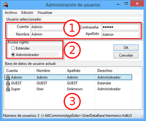
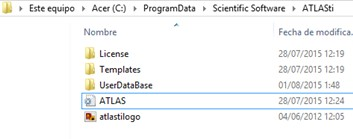
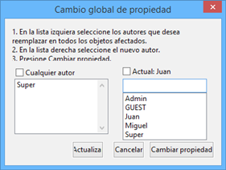
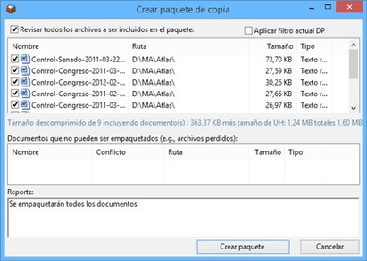
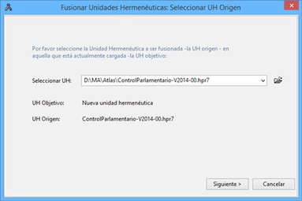

# Otras herramientas

En este capítulo veremos otras herramientas del programa, relacionadas principalmente con la configuración del mismo. No haremos ni mucho menos un repaso exhaustivo, sino que simplemente mencionaremos aquellas que nos parecen más relevantes. De todas formas, aunque las opciones por defecto suelen ser adecuadas en la mayoría de ocasiones, no está de más que el usuario haga un repaso por su cuenta.

## Administración de usuarios

### Usuarios, autores y coautores

Puede que al empezar a trabajar (o a jugar) con el programa hayamos visto que en los *administradores*, en la columna de identificación del creador de citas, códigos, etc., sistemáticamente aparece como autor *Super*. Podemos sentirnos halagados por el hecho de que el programa nos considere *Super*, pero desafortunadamente se trata simplemente de la identificación del usuario por defecto, un superusuario en el sentido de que tiene todos los privilegios posibles.

Si somos el único analista de una UH puede que no sea necesario realizar ningún cambio al respecto (aunque lo consideramos conveniente), pero sí que lo consideramos prácticamente imprescindible cuando el análisis se está realizando en equipo, con diferentes analistas que en algún momento procederán a unir en una única UH el trabajo de cada uno de ellos.

Lo primero que tendremos que hacer, por lo tanto, será crear nuevos usuarios. Para ello, utilizarmos la opción Herramientas &gt; Administración de usuario &gt; Editor de usuario (figura \ref{fig-administracion-usuarios}).

En la figura \ref{fig-edicion-usuarios} vemos (3) que existen tres usuarios predefinidos, *Admin*, *GUEST* y *Super*. En la zona (1) de la pantlla podemos ver los datos identificativos del usuario seleccionado y en (2) sus privilegios, que pueden ser como *Administrador* o como usuario *Estandar*.

Para crear un nuevo usuario, sólo tenemos que acceder al menú Edición &gt; Nuevo usuario e ir completando los datos que se nos van solicitando. Una vez creado el nuevo usuario, hacer clicemos en el menú Archivo &gt; Guardar. Esta es la opción por defecto, pero también podemos elegir Archivo &gt; Guardar como si queremos guardar los cambios en un archivo diferente al que se utiliza por defecto (hermence.hdb). Si lo hacemos así, esa información no estará disponible “por defecto” al abrir el programa, y tendríamos que acceder de nuevo a esta ventana para cargarla con la opción Archivo &gt; Cargar base de datos.

Evidentemente podemos crear tantos usuarios como sea necesario.

 Aunque acabamos de crear un usuario, el programa seguirá identificándonos como *Super* hasta que no realicemos el *Ingreso* (login). Para ello, de nuevo en el menú *Herramientas*, hacer clicemos en Administrador de usuario &gt; Cambiar usuario. La pantalla que aparece (figura \ref{fig-cambiar-usuario}) es bastante evidente, pero queremos destacar la opción *Ingreso automático*, que está activado por defecto. Si la dejamos activada, cada vez que iniciemos el programa el usuario activo será el último que haya sido elegido en esta pantalla.

Otra de las posibilidades es la de definir/cambiar coautorías de la UH. Está disponible en Administrador de usuarios &gt; Coautorías, y se nos ofrecen tres opciones: *Registrar coautores*, *Eliminar coautores* y *Mostrar coautores*. Los coautores serán las personas a las que se les da permiso para acceder a la UH, pero evidentemente esta opción no tienen ningún efecto si hemos dejado activada la opción *Ingreso automático*.

### Protección de acceso

Como nos habremos dado cuenta, aunque en el momento de crear nuevos usuarios se nos solicita definir una contraseña, esa información, no se nos ha solicitado en ningún momento para acceder al programa o a alguna UH. Para configurar el programa para que solicite la contraseña, es necesario realizar un cambio en el archivo *ATLAS.INI*^[Recomendamos hacer una copia antes de realizar cambios en el archivo.]*,* que está en la carpeta de datos comunes de la aplicación. En la figura \ref{fig-atlas-ini} podemos ver la ubicación, pero la forma más fácil de acceder a la misma es Herramientas &gt; Explorador &gt; Datos de aplicación común, que abrirá directamente esa carpeta.

El cambio que tenemos que hacer en ese archivo es modificar la línea

relaxedUserManagement = enabled

por

relaxedUserManagement = disabled

A partir de ese momento será necesario introducir la contraseña correspondiente junto al nombre de usuario, para poder iniciar una sesión.

Por defecto, cuando creamos una UH está tendrá la propiedad de ser *Privada*, por lo que sólo tendrán acceso a la misma su creador y las personas que se hayan definido como coautoras, pero podemos cambiar ese comportamiento con la opción Herramientas &gt; Adnministrador de usuarios &gt; Cambiar derechos de acceso, que nos permitirá dar acceso a esta UH a otras personas con posibilidades de edición Público – leer y escribir o sólo con derechos de visualización pero no para realizar cambios Público – solamente lectura. Esta última opción puede ser interesante en aquellos casos en que queremos que alguien vea nuestro trabajo (un colega o incluso un comité evaluador por ejemplo) pero que no haga cambios.

 En el menú *Cambiar derechos de acceso* encontramos otra opción para proteger la UH que puede ser más práctica y con toda seguridad más sencilla que la explicada anteriormente, consistente en asignar una contraseña a la UH. Una vez asignada la contraseña, será necesario ingresarla para tener acceso a la UH. De esta forma, sólo podrán hacerlo los usuarios que la conozcan^[Cuando se crea o cambia la contraseña es imprescindible guardar la UH para que los cambios tengan efecto.].

Si en algún momento queremos anular la contraseña, simplemente tenemos que seleccionar alguna otra de las opciones de derechos de acceso, volver a *Privado* por ejemplo^[Se nos pedirá introducir la contraseña actual para confirmar el cambio, e igualmente que al crearla será necesario guardar la UH para que el cambio sea efectivo.].

### Propiedad de objetos

Para finalizar con las opciones de administración de usuarios, otra de las posibilidades que tenemos es la de cambiar globalmente la autoría de todo lo creado hasta el momento en la UH. Esta opción puede ser práctica si hemos empezado el análisis en una UH sin crear nuestro propio usuario y queremos aparecer como autores en vez de *Super*. Para ello, utilizaremos la opción Herramientas &gt; Administración de usuario &gt; Cambiar propiedad del objeto. Nos aparecerá una ventana como la de la figura \ref{fig-cambio-propiedad} en la que, como vemos tenemos dos zonas con nombres de usuarios. A la izquierda, aparecen los usuarios que tienen objetos en propiedad. En este caso aparece únicamente *Super*. En la zona derecha de la ventana aparecen todos los usuarios definidos. Para cambiar la propiedad, sólo tenemos que seleccionar un usuario en la zona derecha y otro en la zona derecha a quien le será transferida la propiedad de todos los objetos de la UH al hacer clic en *Cambiar propiedad.*

Esta opción de cambio de propiedad afecta a **todos** los objetos de la UH. Si queremos, hacer cambios sólo para objetos concretos, podemos hacerlo con la opción Miscelánea &gt; Cambiar autor, presente en prácticamente todos los *administradores.*

## Copiar/Restarurar la Unidad Hermenéutica

Uno de los problemas a los que suelen enfrentarse los usuarios de ATLAS.ti es el de “trasladar” una UH de un ordenador a otro. Básicamente, lo que suele ocurrir es que suelen olvidarse que la UH no incluye los DPs, por lo que no copian también los DPs asociados a la misma y, al abrir la UH en otro ordenador descubren alarmados que los DPs han desaparecido.

Para evitar que ocurra esto existen dos alternativas. La primera es realizar la asignación de documentos utilizando la opción *Asignar documentos externos (ver* Asignar archivos externos, pág.46) y tener siempre la UH y los DPs en la misma carpeta del ordenador. De esta forma, si queremos trasladar nuestro trabajo a otro ordenador, sólo tenemos que copiar esa carpeta, que contendrá todo lo necesario para continuar nuestro análisis sin problemas.

La segunda opción, es utilizar la herramienta de copia de que dispone el programa, que encontraremos en el menú Proyecto &gt; Guardar paquete de copia. Posteriormente, podremos restaurar la copia así creada con la opción Proyecto &gt; Desempaquetar la copia.

Como vemos en la figura \ref{fig-paquete-copia}, el programa nos mostrará todos los DPs asignados a la UH activa para que seleccionemos aquellos que queremos incluir en la copia (en el caso de que no los querramos incluir todos). También nos informa de posibles conflictos con los documentos.

Este sistema copia única y exclusivamente los documentos y la UH, cualquier otro archivo que pueda estar vinculado, como por ejemplo memos con documentos asociado, con la UH, será ignorado.

Una vez que cliquemos al botón *Crear paquete*, se creará, en la ubicación que decidamos, un arhivo de copia, con el mismo nombre que la UH y con extensión *atlcb.* En la figura \ref{fig-archivo-copia} vemos el resultado de nuestra copia. En este caso, dado que estamos creándola para trasladar nuestro trabajo a otro ordenador, hemos guardado el archivo en una carpeta de un lápiz de memoria.

A continuación, en el otro ordenador, accedemos al menú Proyecto &gt; Desempaquetar la copia. Se nos abrirá una ventana como la de la figura \ref{fig-desempaquetar} en la que destacamos en primer lugar (1) que se nos ofrecen dos opciones de desempaquetado: *Migrar* o *Restaurar.*

En este caso lo que queremos es evidentemente una migración, por lo que dejamos activada esa opción. En (2) se nos informa del destino de la copia (el archivo en el lápiz de memoria) y se nos da a elegir si queremos migrar o no también la UH. En (3) aparece el origen de la copia. En este caso, la carpeta *textbank.* Dado que el archivo origen se encontraba en una carpeta denominada “ControlParlamentario”, al realizar la copia se creará esa carpeta en *textbank* en el ordenador de destino. En (4) podemos ver los DPs que se van a copiar, junto a un código de color que nos indica si hay algún conflicto para realizar la copia o no.. Y finalmente en (5) se nos muestra de forma textual el estatus de la copia.

La otra opción que podemos seleccionar en (1) es *Restaurar*, es decir, sobreescribir una UH existente con datos que hemos guardado previamente, volviendo a un estado anterior de la misma. Es decir, que en este caso se utilizaría el archivo de copia como una copia de seguridad que nos permitiría solucionar posibles pérdidas de la UH en la que estemos trabajando.

## Unir Unidades Hermenéuticas

En algunas ocasiones, el trabajo de análisis no lo realizará un único analista, sino que varios miembros de un equipo pueden responsabilizarse de realizar, como mínimo, un análisis inicial. Las estrategias de trabajo para realizar el trabajo de esta forma pueden ser diferentes, pero prácticamente todas implicarán que en algún momento existirán diferentes UHs que sería conveniente convertir en una única UH que contenga el trabajo de los diferentes analistas.

Para poder realizar la unión, disponemos de la herramienta de fusión, en el menú Proyecto &gt; Fusionar con UH.

En la primera pantalla que aparecerá (figura \ref{fig-fusionar-primer}) sólo tenemos que seleccionar la UH origien y la UH destino. En este caso, como podemos ver, la UH destino es una *Nueva unidad hermenéutica*, porque en nuestro caso, en el momento de seleccionar la opción de fusión no tenemos ninguna UH activa. En el caso de que la tuviéramos, esa sería la unidad objetivo (pero creemos que es mejor realizar la fusión de las diferentes UHs en una nueva).

Una vez que hemos seleccionado un origen, y clicamos en *Siguiente*, nos aparecerá una nueva ventana (figura \ref{fig-fusionar-segundo}) en la que tenemos que tomar toda una serie de decisiones en función de la estrategia de trabajo que hayamos elegido.

En la parte izquierda de la pantalla (1 en la Ilustración) nos aparecen diferentes posibles estrategias de trabajo en equipo. Las opciones de fusión que aparecen en (2) se ajustarán, en función de la estrategia que seleccionemos, a unos valores predeterminados que podremos modificar si no se ajustan a nuestras necesidades.

Como vemos, las estrategias predefinidas se basan en si los DPs en las diferentes UHs que queremos fusionar son los mismos o diferentes, y lo mismo para el caso de los códigos.

En la práctica, esto significa que nuestra estrategia de análisis en equipo ha podido implicar que diferentes analistas trabajan de forma simultánea con los mismos DPs, es decir, todos ellos analizan los mismos datos, o que cada uno de los analistas ha trabajado con una parte de los datos (DPs) de forma independiente. Además, independientemente de lo anterior, hemos podido decidir que cada analista irá creando *códigos* a medida que avanza su análisis o que todos ellos parten de una lista de códigos comunes.

Por nuestra parte, consideramos que una buena estrategia para el análisis en equipo es optar por la opción Diferentes DPs – Mismos códigos.

En cuanto a los códigos, podríamos pensar que si nuestra análisis es de tipo inductivo evidentemente tenemos que escoger la opción códigos diferentes, pero en la práctica esto no es así, puesto que una opción perfectamente válida es partir de una lista de códigos previamente consensuada por el equipo de investigación a partir de la lectura previa de los datos (lectura previa que teóricamente deberíamos hacer en cualquier caso). Se trata de un trabajo que requiere la inversión de una buena cantidad de tiempo, pero que entendemos que se trata de una inversión que será provechosa. Puede ser interesante al respecto leer el artículo de MacQueen et al. (1998).

Una vez que hemos seleccionado la estrategia, repasaremos las opciones que aparecen en (2) en la Ilustración. Como vemos, para cada uno de los elementos de la UH que podemos fusionar, podemos elegir tres opciones: *Agregar*, *Unificar* o *Ignorar.*

*Agregar* un elemento significa que se añadirá a la UH destino aunque exista en ella otro con el mismo nombre. En este caso, el objeto origen será renombrado con el mismo nombre que el original, pero añadiéndole un número. Por ejemplo, si con la estrategia que proponemos elegimos *Agregar* códigos (una opción que no está marcada por defecto), dado que las diferentes unidades tienen los mismos códigos, tendríamos para cada uno de los códigos tantas versiones como UHs estemos fusionando (*Evasion*, *Evasion\_1*, *Evasion\_2.*..

*Unificar* implica que si un elemento con el mismo nombre existe en la UH origen y en la destino, se mantendrá el de la UH destino, heredando los atributos del elemento de la UH origen.

Evidentemente, la opción *Ignorar* implica que ese tipo de elementos no serán añadidos a la UH destino.

En principio, las opciones por defecto para cada una de las estrategias deberían funcionar de forma adecuada, pero podemos cambiarlas. Por ejemplo, podemos decidir *Agregar* las *Memos* si consideramos (nosotros lo creemos así) que es conveniente que todas las que hayan creado los diferentes analistas tienen que figurar en la UH final.

Una vez que hemos comprobado todas las opciones, podemos hacer clic en *Terminar*. Este proceso tendremos que realizarlo tantas veces como UHs diferentes tengamos.
