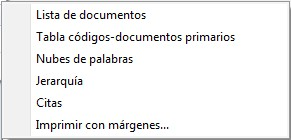
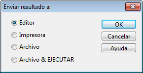
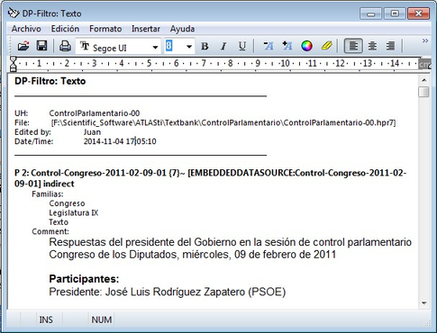
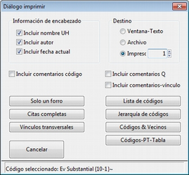

# Informes

El trabajo del analista implicará pasar un número considerable de horas delante de la pantalla de un ordenador, pero también la necesidad de visualizar, preferiblemente en formato papel, los resultados de su análisis. Anteriormente, en el apartado dedicado a la Visualización de las citas de un código (pág. 82) comentábamos la necesidad de realizar revisiones o depuraciones de los contenidos de los códigos, es decir, revisar si las citas que incluyen son efectivamente las adecuadas para ese código. Este sería sólo uno de los múltiples casos en que nos puede ayudar las múltiples posibilidades de informes que nos ofrece ATLAS.ti.

Dado el gran número de posibilidades que nos ofrece el programa en cuanto a la elaboración de informes, sería excesivamente tedioso exponerlas todas aquí, por lo que preferimos mostrar aquí sólo los principios generales de creación de informes y algunos de los que consideramos más interesantes. Dejamos a la iniciativa del lector explorar todas las posibilidades.

Prácticamente todos los menús del programa incluyen una opción *Imprimir*, que ofrecerá a su vez diferentes formatos de listados relacionados con el tipo de menú que hayamos seleccionado. A título de ejemplo, en la figura \ref{fig-informes-DP} vemos las opciones del menú *Imprimir* para el caso de los DPs.

También podemos encontrar el menú *Imprimir* en muchos de los *administradores*, y en algunos de ellos también un icono de impresora que da acceso a algunas opciones particulares.

Podemos empezar, por ejemplo solicitando un informe con la lista de DPs de nuestra UH. Por lo tanto, seleccionaremos Documentos &gt; Imprimir &gt; Lista de documentos. Lo primero que aparecerá será una ventana en la que se nos preguntará si queremos incluir en el informe los comentarios de los documentos[^1]. Esto puede ocurrir también en otros informes, e incluso se nos puede preguntar sobre la inclusión de alguna otra información.

Una vez que hemos contestado esas preguntas, aparecerá una nueva ventana (figura \ref{fig-informes-enviar}) en la que tendremos que especificar el destino del informe: *Editor*, *Impresora* o *Archivo* (o la opción *Archivo & EJECUTAR*, que guardará en un archivo y mostrará en pantalla). Recomendamos utilizar la opción *Editor*, puesto que podremos ver el informe en pantalla (en un editor de texto) para comprobar que es efectivamente el tipo de informe que deseamos, y posteriormente, utilizando las funcionalidades del editor, podemos guardar el archivo y/o imprimirlo.

En la figura \ref{fig-listado-DP} podemos ver el resultado del informe anterior. De entrada, podemos apreciar que los informes no son sofisticados estéticamente, son únicamente archivos de texto que cumplen únicamente la función de ser archivos de trabajo.

También podemos apreciar que el informe nos ofrece una serie de informaciones adicionales. En este caso, en primer lugar, se nos informa que el informe se ha ejecutado con un filtro activo *Filtro: Texto*, ya que hemos aplicado un filtro en base a una de las familias que habíamos creado previamente, dado que sólo queremos información de los documentos de texto (no queremos que se incluyan los de audio ni los de vídeo). Esto significa que, además de las múltiples posibilidades de informes de que disponemos, podemos “afinar” los resultados que obtenemos utilizando *filtros*, puesto que al activar un filtro todas las operaciones que se realizan a continuación afectan sólo a los elementos activos.

A continuación se nos ofrece datos informativos sobre la UH en la que hemos ejecutado el listado.

Y finalmente, aparece el listado, en el que de nuevo, para cada uno de los elementos, aparece información contextual, las familias a las que pertenece y el comentario que habíamos decidido incluir en el primer paso de generación del informe.

Otro posible informe interesante es el que podemos hacer de las citas de determinados códigos para, como comentábamos realizar una depuración de las mismas. Para ello, una vez que hayamos seleccionado el código del que queramos obtener el listado, utilizaremos la opción Imprimir &gt; Citas de código seleccionado del menú *Códigos* (figura \ref{fig-listado-codigos}).

Como vemos en la Ilustración, podemos solicitar una gran variedad de tipos de informes relacionados los códigos, entre los que el lector debería explorar como mínimo los de *Códigos con comentarios* y *Tabla códigos-documentos primarios.*

Las opciones de informes relacionados con códigos también están disponibles en el *administrador de códigos*, en el menú *Imprimir*. En este administrador encontraremos además un icono de impresora que permitirá acceder a una ventana especial de generación de informes.

[^1]: Esta ventana no aparecerá siempre, sólo lo hará cuando el elemento que queremos listar tiene información de ese tipo. Por ejemplo, si pedimos un listado de citas de un código pero ninguna cita tiene asociados comentarios o memos ni tiene hypervínculos, esta pantalla no aparecerá.

