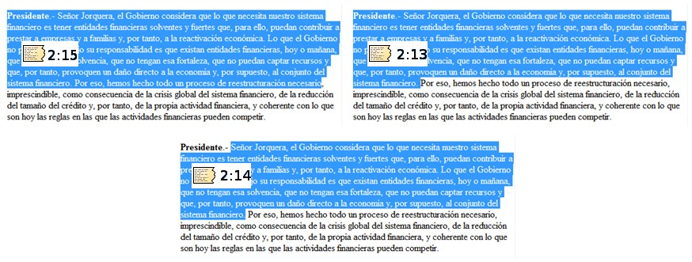
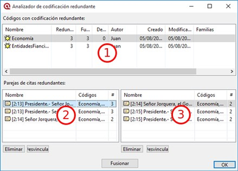

## Analizador de codificaciones

Otra herramienta que puede sernos interesante en algunas fases del análisis es el *Analizador de codificaciones*, que nos informará de si existen codificaciones redundantes, es decir, códigos que han sido relacionados con citas muy similares, entre las que hay sólo una ligera diferencia. El *analizador* nos informará de ello y dejará al analista la decisión de qué hacer en esos casos.

En la figura \ref{fig-codificacion-redundante} podemos ver un hipotético ejemplo de codificación redundante. Tenemos un mismo párrafo con tres citas muy similares. Entre la primera y la segunda la diferencia es que la primera incluye algo más de texto. Entre la segunda y la tercera, la única diferencia es que en un caso se ha incluido la identificación de hablante (*Presidetne.-*) y en el otro no. En este caso todas las citas han sido codificadas con el mismo código *Economía*.

Al utilizar el *Analizador de codificación redundante*, aparecerá una ventana como la de la figura \ref{fig-analizador-codificacion}, en la que podemos ver (1) los códigos que según el programa podrían incluir citas redundantes. Si seleccionamos uno de esos códigos, en (2) y (3) se nos mostrarán las parejas de citas que podrían ser redundantes.

Podemos entonces decidir si queremos *eliminar* o *desvincular* la cita en (2) o en (3) o si queremos *fusionar* ambas citas.
