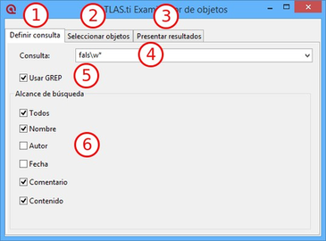
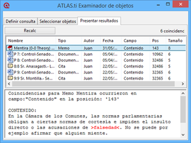

## Búsqueda ampliada: Examinador de objetos

Como hemos visto, la herramienta de búsqueda se limita a búsquedas de texto en los DPs, pero podríamos necesitar realizar búsquedas más amplias que incluyan otros componentes de nuestra UH. Por ejemplo, podríamos necesitar realizar una búsqueda de texto en los comentarios de los objetos \(citas, códigos...\) o en las memos. En ese caso podemos utilizar la herramienta _Examinador de objetos_, que nos permitirá ampliar la búsqueda a cualquier contenido textual de la Unidad Hermenéutica. Estas búsquedas, además, podrán realizarse utilizando tanto la opción de “búsqueda por categorías” como la de “búsqueda GREP” descritas previamente.

Al activar la herramienta con la opción Herramientas &gt; Examinador de objetos, nos aparecerá la ventana que podemos ver en la figura \ref{fig-examinador-definicion}, que en la práctica está compuesta por tres secciones, puesto que son tres los pasos de la búsqueda.

En primer lugar \(1\) definiremos la sentencia de búsqueda, para a continuación seleccionar los objetos a los que se aplicará la misma \(2\). Finalmente, en \(3\) podremos ver los resultados.

En la sección _Definir consulta_, definiremos la búsqueda a realizar \(4\) y si queremos o no utilizar la sintaxis GREP \(5\).\[^1\] Finalmente seleccionaremos \(6\) el ámbito al que se aplicará la búsqueda, es decir, en qué secciones de los diversos componentes \(nombre del componente, comentario...\).

En el ejemplo de la Ilustración estamos realizando una búsqueda utilizando sintaxis GREP. En este caso, una búsqueda de las apariciones de diferentes modalidades de referencia a “falsedad”. Si hemos leído el apartado dedicado a la búsqueda GREP podemos traducir la expresión de búsqueda como “busca las apariciones de “fals” seguidas de cualquiera otros caracteres \(utilizando la expresión GREP \w\*. Por lo tanto, el resultado debería incluir términos como “falso”, “falsedad”, “falsos”, etc.

La segunda sección del _Examinador de objetos_ \(figura \ref{fig-examinador-seleccion}\) nos permite seleccionar los objetos \(componentes\) a los que se aplicará la búsqueda.\[^2\] Por lo tanto, si en la pantalla anterior hubiéramos seleccionado únicamente _Comentario_ como ámbito de búsqueda y en esta otra seleccionamos todos los objetos, la búsqueda se realizaría únicamente en los comentarios de todos los objetos de la UH. Si el término apareciera por ejemplo en una cita \(pero no en un comentario de cita\), la búsqueda no lo incluiría.

La última sección de la herramienta nos muestra finalmente los resultados de la búsqueda. Como podemos ver en la figura \ref{fig-examinador-resultados}, la búsqueda ha dado como resultado 12 coincidencias, que incluyen anotaciones, códigos, documentos y citas. En la misma ilustración podemos ver cómo, al seleccionar uno de los resultados, en la parte inferior de la ventana podemos ver el contexto en el que se encuentra. En este caso, la palabra “falsedad” aparece en la memo _Mentira_.

\[^1\]: Podemos utilizar también la búsqueda por categorías.

\[^2\]: _Unidad Hermenéutica_ hace referencia al comentario de la _Unidad Hermenéutica_.

