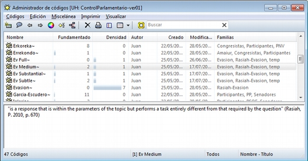
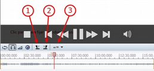

## Citas

Como hemos comentado anteriormente, nuestra estrategia de análisis puede implicar crear las citas antes que los códigos, aunque como también veremos, en muchas ocasiones crearemos las citas al mismo tiempo que creamos y/o aplicamos los códigos.

### Creación de citas “libres”

Si nuestro análisis es de tipo inductivo, una posibilidad es que empecemos creando *citas libres* a partir de la lectura del texto y la identificación de fragmentos que tienen algún significado en función de nuestros objetivos de análisis.

Para la creación de *citas libres*, lo único que tenemos que hacer es seleccionar el fragmento de texto, hacer clic sobre él con el botón derecho del ratón y seleccionar la opción *Crear Cita libre* en el menú contextual que aparecerá. Podemos crear la cita también con la opción *Nuevo desde la selección* del menú *Citas*. Por último, también podríamos crearla arrastrando el texto seleccionado hasta el administrador de citas.

### Citas multimedia

De la misma forma que con los documentos con formato texto, podemos crear citas en los documentos multimedia, ya sean imágenes, audio o vídeo, aunque el proceso de selección del fragmento significativo será diferente.

En el caso de las imágenes, simplemente tenemos que seleccionar con el ratón el fragmento deseado de la imagen en una sección rectangular y, como antes, hacer clic sobre él con el botón derecho del ratón para seleccionar la opción *Crear Cita libre* (figura \ref{fig-cita-imagen}). Podemos crear citas de esta forma tanto en los documentos de imagen (archivos *jpg*, p*ng*...) como en las imágenes incluidas en los documentos de tipo PDF, pero no en imágenes que formen parte de un documento de texto que no sea PDF. En ese caso sólo puede convertirse en cita le imagen completa.

En el caso de los documentos de audio y de vídeo, el proceso de creación de la cita implicará como primer paso seleccionar un punto de inicio y un punto final en la línea de tiempo que definen el lapso a transformar en cita. Para ello, utilizaremos los iconos que podemos ver en la figura \ref{fig-cita-multimedia}.

El primero define el punto de inicio de la cita, el segundo el punto de finalización y el tercero permite crea la cita. Recomendamos que la “mecánica” de la creación de la cita sea la siguiente:

1. Marcar el inicio en el momento deseado mientras se va reproduciendo el archivo (1).

2. Una vez que lleguemos al punto en el que queremos que finalice la cita hacer pausa en la reproducción.

3. Marcar el punto final de la cita (2).

4. Crear la cita (3).

Si hacemos clic en el icono de creación de cita después de marcar un punto de inicio y antes de marcar un punto final, se creará el punto final y la cita al mismo tiempo.

### Visualización

La visualización en la lista desplegable nos muestra el símbolo \~, indicándonos que la cita tiene un comentario. El identificador numérico de la cita, que aparece a continuación, está compuesto de un primer número que indica el DP al que pertenece la cita, y de un segundo número conforme al orden en que se ha creado la cita. A continuación, aparecerá la etiqueta de la cita. Si trabajamos con DP de texto, la etiqueta es consistente en los primeros caracteres del contenido de la cita. Finalmente, los últimos números nos indican el párrafo de inicio y fin de la cita. En el caso de que la cita esté relacionada con otras citas, veremos también los signos &lt; o &gt;, según la posición que ocupe en la relación.

La lista desplegable y el administrador de citas también nos permiten seleccionar una cita para su visualización contextualizada en el documento al que pertenecen. En el caso del administrador, podemos desplazarnos por ellas haciendo doble clic sobre sus etiquetas. En ese caso, en la pantalla principal se visualizará el documento primario al que pertenece la cita en la sección en la que la cita se ubica y ésta aparecerá seleccionada. También podemos desplazarnos fácilmente de una cita a otra utilizando los iconos de desplazamiento  del administrador.
