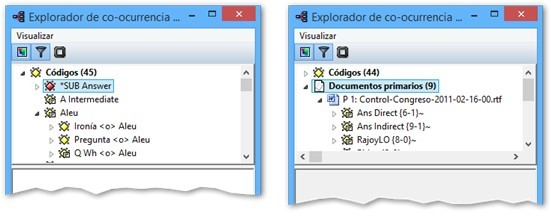

## Concurrencias

Más arriba hemos ilustrado el concepto de *concurrencia*, y hemos visto que podemos realizar consultas utilizando el operador *cooccur* para recuperar citas que cumplan la condición de estar codificadas de forma coocurrente con varios códigos. En esta sección veremos dos herramientas adicionales que permiten seguir explorando las concurrencias.

### Árbol de concurrencias

El árbol de concurrencias es una herramienta similar a los otros “árboles” que hemos visto en el apartado Exploración de objetos (pág. 145), pues nos muestra una estructura jerarquizada de objetos que podemos ir desplegando para llegar hasta cierto nivel de detalle. Las dos ramas principales de objetos son los códigos y los documentos primarios . En el caso de los códigos (figura \ref{fig-explorador-concurrencias} izquierda) visualizamos el conjunto de códigos de la UH y, en aquellos casos en que se produce concurrencias podemos desplegar la rama del código para visualizar con qué códigos se produce dicha concurrencia y finalmente en qué citas concretas. En el caso de los DPs, la expansión de la rama de documento nos mostrará una visualización idéntica a la anterior, con la única diferencia de que en este caso no visualizamos los códigos del conjunto de la UH, sino únicamente aquellos en los que se producen concurrencias para el documento seleccionado. (figura \ref{fig-explorador-concurrencias} derecha)

### Tabla de concurrencias

La otra herramienta que nos ofrece información sobre las concurrencias es la que podemos ver en la Ilustración. La *Tabla de concurrencias* nos permite visualizar de una forma mucho más eficaz los casos de códigos que tienen concurrencias de citas, puesto que nos permite literalmente construir una tabla de doble entrada donde las filas y las columnas son códigos y las celdas nos informan de la cantidad de citas que coocurren en esos códigos.

En la figura \ref{fig-tabla-concurrencias}, en (1) y (2) se nos muestran el conjunto de códigos de la UH, para que podamos seleccionar aquellos que queremos incluir en la tabla como columnas (1) y como filas. En este caso la zona de códigos de filas está vacía puesto que los hemos incluído todos en nuestra tabla. En (3) y (4) aparecen los códigos que hemos seleccionado para columnas y filas. Como podemos ver, hemos seleccionado en columnas los códigos que hacen referencia a Zapatero y a Rajoy (tanto líder de la oposición como presidente), puesto que queremos tener una “visión panorámica” de las coocurrencias que se producen entre ellos. Por ese motivo, hemos incluido como filas la totalidad de códigos de la UH. El resultado, la tabla, aparece en (5). Finalmente, en (6) y (7), al seleccionar alguna de las celdas, aparecen las citas que coocurren.

