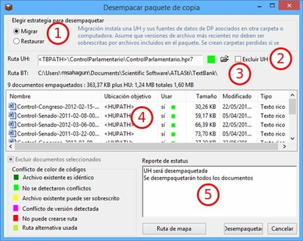

## Copiar/Restarurar la Unidad Hermenéutica

Uno de los problemas a los que suelen enfrentarse los usuarios de ATLAS.ti es el de “trasladar” una UH de un ordenador a otro. Básicamente, lo que suele ocurrir es que suelen olvidarse que la UH no incluye los DPs, por lo que no copian también los DPs asociados a la misma y, al abrir la UH en otro ordenador descubren alarmados que los DPs han desaparecido.

Para evitar que ocurra esto existen dos alternativas. La primera es realizar la asignación de documentos utilizando la opción *Asignar documentos externos (ver* Asignar archivos externos, pág.46) y tener siempre la UH y los DPs en la misma carpeta del ordenador. De esta forma, si queremos trasladar nuestro trabajo a otro ordenador, sólo tenemos que copiar esa carpeta, que contendrá todo lo necesario para continuar nuestro análisis sin problemas.

La segunda opción, es utilizar la herramienta de copia de que dispone el programa, que encontraremos en el menú Proyecto &gt; Guardar paquete de copia. Posteriormente, podremos restaurar la copia así creada con la opción Proyecto &gt; Desempaquetar la copia.

Como vemos en la figura \ref{fig-paquete-copia}, el programa nos mostrará todos los DPs asignados a la UH activa para que seleccionemos aquellos que queremos incluir en la copia (en el caso de que no los querramos incluir todos). También nos informa de posibles conflictos con los documentos.

Este sistema copia única y exclusivamente los documentos y la UH, cualquier otro archivo que pueda estar vinculado, como por ejemplo memos con documentos asociado, con la UH, será ignorado.

Una vez que cliquemos al botón *Crear paquete*, se creará, en la ubicación que decidamos, un arhivo de copia, con el mismo nombre que la UH y con extensión *atlcb.* En la figura \ref{fig-archivo-copia} vemos el resultado de nuestra copia. En este caso, dado que estamos creándola para trasladar nuestro trabajo a otro ordenador, hemos guardado el archivo en una carpeta de un lápiz de memoria.

A continuación, en el otro ordenador, accedemos al menú Proyecto &gt; Desempaquetar la copia. Se nos abrirá una ventana como la de la figura \ref{fig-desempaquetar} en la que destacamos en primer lugar (1) que se nos ofrecen dos opciones de desempaquetado: *Migrar* o *Restaurar.*

En este caso lo que queremos es evidentemente una migración, por lo que dejamos activada esa opción. En (2) se nos informa del destino de la copia (el archivo en el lápiz de memoria) y se nos da a elegir si queremos migrar o no también la UH. En (3) aparece el origen de la copia. En este caso, la carpeta *textbank.* Dado que el archivo origen se encontraba en una carpeta denominada “ControlParlamentario”, al realizar la copia se creará esa carpeta en *textbank* en el ordenador de destino. En (4) podemos ver los DPs que se van a copiar, junto a un código de color que nos indica si hay algún conflicto para realizar la copia o no.. Y finalmente en (5) se nos muestra de forma textual el estatus de la copia.

La otra opción que podemos seleccionar en (1) es *Restaurar*, es decir, sobreescribir una UH existente con datos que hemos guardado previamente, volviendo a un estado anterior de la misma. Es decir, que en este caso se utilizaría el archivo de copia como una copia de seguridad que nos permitiría solucionar posibles pérdidas de la UH en la que estemos trabajando.
