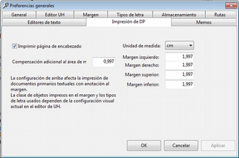

## Documento con margen

Una de las opciones de impresión más interesantes es la que nos permite imprimir exactamente la visualización que tenemos en la pantalla principal del programa, es decir, imprimir no sólo el documento, sino también el margen derecho, con la representación de citas, códigos, hiperenlaces…

Esta opción puede sernos especialmente práctica si queremos realizar una revisión *offline* de nuestro trabajo, lejos de la pantalla del ordenador, o incluso si queremos que esa revisión la realice alguien que no dispone del programa.

Accederemos a este informe con la opción Documentos &gt; Imprimir &gt; Imprimir con márgenes..

Una diferencia entre este informe y el resto de informes es que en esta ocasión no se nos ofrecerá la opción de elegir el destino del mismo (editor, archivo, impresora), puesto que sólo lo podremos enviar a la impresora (o guardarlo como PDF si tenemos esa posibilidad desde nuestras opciones de impresión). Por lo tanto, al ejecutar el comando lo primero que aparecerá será la ventana de impresión estándar de nuestro ordenador. Una vez que cliquemos en imprimir, el resultado será similar al que vemos en la figura \ref{fig-imprimir-margen}^[El listado incluye también una primera página con información sobre el documento que incluye, entre otras cosas, el comentario del mismo. El formato de salida ha sido].

Si el resultado de la impresión del informe no es el deseado, podemos realizar cambios con la opción Herramientas &gt; Preferencias &gt; Preferencias generales, en la pestaña Impresión de DP. Como podemos ver en la figura \ref{fig-preferencias-margen}, lo que se nos ofrece es poco más que la posibilidad de cambiar los márgenes.

