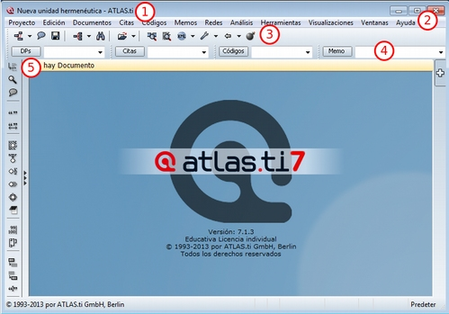
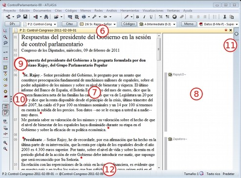
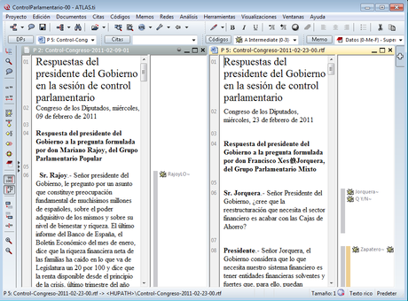
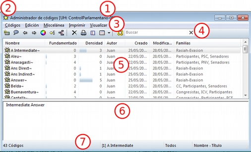

## La pantalla principal de ATLAS.ti

### Espacio de trabajo

Antes de continuar, es necesario que comencemos a familiarizarnos con la pantalla principal de ATLAS.ti (figura \ref{fig-interfaz}).

A continuación, ofrecemos una breve descripción de los elementos que la componen:

1. Título de la UH. Muestra el nombre de la UH activa. Se corresponde con el nombre con que se haya guardado el archivo (como podemos ver en la imagen, si no tenemos ninguna UH activa, aparecerá como título “Nueva unidad hermenéutica”).

2. Barra de menús. Permite acceder a las diferentes acciones relacionadas con ficheros, documentos, citas, códigos, anotaciones, etc. A las opciones más comunes también podemos acceder a través de las barras de iconos (3 y 5 en la figura \ref{fig-interfaz}) y, sobre todo, utilizando los menús contextuales, a los que se accede haciendo clic con el botón derecho del ratón sobre los diferentes elementos que aparecen en pantalla.

3. Barra de iconos horizontal. Los iconos de la barra horizontal sirven como ‘acceso directo’ a algunas de las funciones más utilizadas en relación con la UH.

4. Botones de administradores y listas desplegables. Los botones permiten activar los administradores (ver Administradores y listas desplegables en pág. 26) de cada uno de los componentes principales de la UH, mientras que las listas desplegables permiten visualizar/seleccionar los diferentes elementos creados para cada uno de esos componentes principales). Tanto los botones de administradores como las listas desplegables hacen referencia, de izquierda a derecha, a DPs, Citas, Códigos y Memos^[Esta disposición puede ser modificada por el usuario.].

5. Barra de iconos vertical. Los iconos de la barra vertical realizan funciones relacionadas con los DPs. Aunque estos iconos siempre son visibles, sólo son operativos con un DP activado. En caso contrario, los iconos aparecen en gris claro.

Cuando se activa un DP de texto, queda conformada el área de trabajo básica. Los elementos que aparecen con el área de trabajo son (ver figura \ref{fig-interfaz-doc}):

6. Información del documento activo. Muestra el nombre del DP activo y, los iconos que aparecen a la derecha, permiten cerrar el documento y abrir (en el caso de que existan), los documentos relacionados con el DP activo (ver Sincronización audio-texto en pág. 58)

7. Ventana de Documentos Primarios. En ella podremos visualizar el DP activo para realizar el trabajo de segmentación y codificación o, en fases posteriores del análisis, para consultar o modificar las Citas creadas o su vinculación a determinados códigos.

8. Margen derecho. Esta sección ofrece información sobre los elementos relacionados con el texto que se esté visualizando en ese momento. Las barras verticales señalan la ubicación de las Citas en el documento y los elementos con los que están relacionadas, sean Códigos, Hipervínculos (relaciones con otras citas) o Memos. La cantidad de elementos visibles en este espacio tiene una relación directamente proporcional con el trabajo interpretativo realizado sobre el DP en cuestión.

9. Numeración de los párrafos del documento. Esta forma de visualización es especialmente útil cuando queremos identificar la ubicación de una cita en el texto a partir de un listado de citas, pues como veremos más adelante (pág. 76), las etiquetas de las citas incluyen información sobre el número de párrafo de inicio y fin en el documento.

10. Navegadores de elementos. Podemos además, (figura \ref{fig-navegadores}), activar/desactivar (haciendo clic en el icono con tres cabezas de flecha) la visualización de “navegadores” de elementos, pudiendo seleccionar si deseamos visualizar lista de documentos, códigos, citas, memos o vistas de red.

 

11. Haciendo clic en este icono, podemos visualizar simultáneamente más de un DP en la pantalla principal (ver figura \ref{fig-dos-docs}).

 

12. Barra de estado. Presenta información sobre el DP activo, incluyendo el nombre completo del archivo, su ubicación y forma de asignación a la UH y el tamaño con el que se visualiza. Permite hacer algunas operaciones como cambiar el porcentaje de visualización (aumentar o reducir la apariencia del DP). Ofrece además un pequeño texto de ayuda relacionado con la opción de menú sobre el que se sitúe el cursor para recordarnos las acciones que realizan los diferentes menús.

Hasta ahora, hemos presentado la pantalla principal de ATLAS.ti 7 con DPs activos de tipo textual. En el caso de documentos de imagen, audio, vídeo o geo-referencias hay algunas particularidades de presentación que señalaremos más adelante, al desarrollar la forma en la que se opera en ATLAS.ti con estos tipos de datos. Por otra parte, es conveniente recordar que, si bien existe la posibilidad de reubicar, añadir o quitar elementos a la pantalla principal de ATLAS.ti, recomendamos al usuario novel trabajar con la configuración por defecto y postergar cualquier cambio a nivel de interfaz hasta que se adquiera cierta soltura y familiaridad en el uso del programa.

### Menús

Los menús de la pantalla principal del ATLAS.ti incluyen prácticamente todas las operaciones y opciones de visualización y configuración a las que puede recurrir el usuario o permiten acceder a ellas (figura \ref{fig-barra-menus}). Los menús pueden agruparse en tres categorías: generales, por objeto y extras. Los menús por objeto hacen referencia a opciones y operaciones asociadas a cada uno de los bloques que se van construyendo dentro de su UH conforme avanza en el proceso de análisis.

La descripción pormenorizada de estas operaciones y opciones la iremos realizando a lo largo de los próximos capítulos. Por ahora, haremos una sencilla descripción de lo que contiene cada uno de los 12 menús de tal forma que el usuario cuente con una base para comenzar a utilizar el programa. Es conveniente señalar que algunas de las opciones más utilizadas también pueden ejecutarse con las combinaciones de teclas que aparecen a la derecha del comando.

Siguiendo el orden en el que aparecen de izquierda a derecha, los primeros dos menús son:

**Proyecto**. Este menú es el menú general de la UH y, por tanto, el primero con el que tenemos que familiarizarnos. Contiene comandos que permiten crear, abrir o cerrar UHs, así como editar información general sobre las mismas o generar informes con todos los objetos desarrollados en el proceso de análisis. También hay comandos que permiten fusionar dos UHs —funcionalidad crucial cuando el análisis lo realizan dos o más personas— o analizar y eliminar redundancias y solapamientos en la codificación. Este menú es el menú general de la UH y, por tanto, el primero con el que tenemos que familiarizarnos.

**Edición**. Este menú sólo despliega sus opciones cuando un DP de tipo textual ha sido activado. Dependiendo del formato específico del documento de texto, aparecerán más o menos opciones. En el caso de DPs con formato .rtf (Rich Text Format) y .txt (Text File), las opciones del menú son más numerosas, incluyendo la posibilidad de editar. En otros formatos como .doc (Microsoft Word) o .pdf (Portable Document Format), las opciones del menú son reducidas, pero siguen siendo interesantes, ya que permiten hacer búsquedas o copiar segmentos de texto.

El siguiente grupo de menús ofrecen opciones en cuanto a la creación, edición y visualización de los elementos fundamentales de la UH: documentos primarios, citas, códigos, memos y vistas de red. Muchas de las opciones de este grupo de menús son comunes: crear el elemento, agrupar en familias, generar informes, abrir administradores, etc. Este grupo de menús es quizá el que más se utilizará en el trabajo analítico propiamente dicho y muchas de estas opciones son accesibles también a través de los administradores o desde los menús contextuales. Las opciones serán descritas en detalle en los siguientes capítulos del manual. A continuación, ofrecemos una breve descripción que sirva como punto de partida:

**Documentos**. El menú *Documentos* despliega opciones que nos permiten hacer operaciones relativas a los DPs vinculados a nuestra UH: vincular o desvincular DPs, desactivarlos, reordenarlos o filtrarlos de acuerdo con diferentes criterios, editar comentarios sobre ellos, agruparlos en familias y generar informes. Algunas opciones, como la que nos permite abrir una vista de red, sólo están operativas con un DP activado. El menú incluye el apartado *A-Docs*. Sus opciones nos permiten establecer, modificar y utilizar sincronizaciones entre, por ejemplo, la grabación en audio de una entrevista y su correspondiente transcripción. También existe la posibilidad de importar este tipo de sincronización (ver Sincronización con F4 en pág.58).

**Citas**. De forma análoga al menú anterior, éste nos ofrece opciones para el trabajo con citas: crearlas, transformarlas, eliminarlas, etc. También nos permite abrir vistas de red focalizada en una cita, establecer relaciones entre citas —los hipervínculos— y asignar códigos a citas.

**Códigos**. Junto con el menú anterior, éste es uno de los más relevantes en cuanto a labor analítica se refiere. El menú nos permite operar con códigos, desde su creación y asignación a citas hasta la generación de diversos tipos de informes. Este menú también nos permite establecer relaciones entre códigos y entre códigos y anotaciones.

**Memos**. El menú de Memos también comparte muchas de las opciones de los tres menús anteriores. Nos permite crear, editar y vincular anotaciones (entre sí o con códigos o citas), agruparlas en familias, generar informes e incluso utilizar alguna anotación como DP.

**Redes**. Este menú nos permite generar y editar vistas de red, un recurso vital para operar sobre las relaciones entre los elementos que vamos desarrollando en un proceso de análisis —especialmente los códigos. Otras opciones incluyen la posibilidad de exportar e importar redes de códigos y la edición de los tipos de relaciones que se pueden establecer entre citas (tipos de hipervínculos) y los tipos de relaciones entre códigos.

El último grupo de menús ofrece diversas opciones en cuanto a la configuración de ATLAS.ti así como una serie de complementos que pueden ser más o menos útiles dependiendo del tipo de análisis que se esté realizando y de si se trabaja en grupo o individualmente, entre otras cosas:

**Análisis.** En este menú encontraremos algunas herramientas útiles para el análisis, entre las que cabe destacar el sofisticado sistema de consultas y la herramienta de exploración de co-ocurrencias de códigos.

**Herramientas**. Se trata de un menú con diversas herramientas complementarias que pueden ser muy interesantes, sobre todo en fases avanzadas del análisis. Además del editor de texto propio del ATLAS.ti, el menú incluye un conjunto de opciones para navegar por la UH y sus elementos (explorador de objetos, examinador de objetos, analizador de codificaciones, etc.). El menú permite trabajar con el lenguaje XML, crear archivos que ‘empaquetan’ la UH y los DPs asociados y gestionar las actualizaciones. Habría que destacar la creación y gestión de usuarios, imprescindibles cuando el análisis es realizado por más de una persona. También hay opciones para la exportación de la UH a otros formatos (a SPSS, por ejemplo).

**Visualizaciones**. El menú de visualizaciones nos permite definir la apariencia y las opciones visibles por defecto (barra de herramientas, números de línea, margen derecho, barra de estado, etc.), así como minimizar, maximizar o cerrar con sólo un clic todas las ventanas que tengamos abiertas (salvo la pantalla principal, como es de suponerse).

**Ventanas**. Este menú es útil cuando utilizamos varias UHs de forma simultánea, ya que nos permite navegar entre ellas o dejar alguna siempre por encima de las otras.

**Ayuda**. Además del acceso al sistema de ayuda en línea de ATLAS.ti, este menú ofrece opciones relativas a las ventanas que aparecen al iniciar el programa e incluye opciones sobre el sistema de actualizaciones que ya están en algunos de los menús anteriores, así como la introducción de la licencia del programa.

### Administradores y listas desplegables

Ya hemos hecho referencia a los administradores y listas desplegables en la descripción de las secciones que componen la pantalla principal del ATLAS.ti. Ambos, especialmente los administradores, son sin duda las opciones más empleadas en el transcurso de un proceso de análisis. Las listas desplegables permiten seleccionar los diferentes elementos creados en la UH: DPs, citas, códigos y memos. La selección de los elementos se realiza haciendo clic en la flecha situada a la derecha del recuadro de lista para "desplegarla" y a continuación sobre el elemento deseado (1 en figura \ref{fig-administrador}).

Los iconos que aparecen a la izquierda de cada una de las listas desplegables (2 en Ilustración) abren los administradores de cada objeto. Los administradores permiten visualizar sus correspondientes objetos (DPs, citas, códigos o memos) en ventanas independientes. Además de permitirnos seleccionar y visualizar algún elemento, como en el caso de las listas desplegables, los administradores posibilitan una visualización de conjunto mucho más detallada, con listados de objetos que incluyen sus características más importantes y que pueden reordenarse en función de tales características. Aunque presentan algunas diferencias en cuanto a las funciones que permiten realizar, los cuatro administradores tienen una estructura similar y en buena medida nos ofrecen otra vía para acceder a las opciones que ya aparecen en los menús de cada objeto.

La figura \ref{fig-administrador-docs} nos muestra las secciones que componen el administrador de DPs y que son, en general, comunes al resto de administradores:

1\. En la parte superior del marco de la ventana, está la barra de título, que nos informa del tipo de componente que se está mostrando (en este caso, el administrador de DPs) y la UH a la que pertenece.

2\. Precediendo al título, aparece un icono que variará dependiendo del administrador que estemos utilizando. Al hacer clic sobre el icono se despliega un menú que, entre otras funciones relacionadas con la forma de visualizar la ventana, permite activar el *Modo enrollar*, que colapsa el administrador manteniendo su posición y dejando visible sólo la barra de título cuando hacemos clic sobre cualquier otro elemento de ATLAS.ti (otro administrador, por ejemplo). El administrador volverá a su disposición inicial cuando situamos el cursor encima de la barra colapsada. Otra opción que podemos desactivar (ya que está activada por defecto) es la de *Siempre arriba*, que mantiene al administrador, colapsado o no, siempre visible por encima de la pantalla principal del ATLAS.ti. Cuando esta opción está desactivada y hacemos clic en otro elemento de ATLAS.ti, el administrador se minimiza de forma tradicional, apareciendo en la barra inferior de Windows.

3\. Justo por debajo del marco superior, aparece la barra de menús del administrador. Aunque los menús disponibles tienen algunas variaciones dependiendo del tipo de objeto al que se dedica cada uno, la estructura es similar en términos generales. El primer menú contiene opciones relativas al objeto en cuestión (*Códigos* en el administrador de códigos, *Memos* en el administrador de memos, etc. ) como crear uno nuevo, aplicar un filtro o agrupar por familias. A continuación aparece un conjunto de menús con opciones de edición, misceláneas, imprimir y visualizar.

4\. Iconos con funciones específicas dependiendo del tipo de objeto al que se dedica el administrador.

5\. Elementos según el tipo de administrador e información adicional para cada uno de ellos. En este caso, encontramos una primera columna con el conjunto de códigos definidos en la UH. La segunda columna, *Fundamentado*, nos indica el número de citas con las que está relacionado el código seleccionado, mientras que la columna *Densidad* hace referencia al número de relaciones que ese código tiene con otros códigos. La columna *Autor* nos indica, evidentemente, el usuario que ha creado el elemento (ver Administración de usuarios, pág. 171). A continuación nos encontramos con dos columnas que nos informan de la fecha de creación y de modificación del elemento. Por último, la columna *Familias* nos indica a qué familias pertenece el elemento en cuestión.

Podemos ordenar la visualización con un clic en la etiqueta de la columna que deseemos.

6\. En todos los administradores encontraremos también una zona en la que podemos/debemos escribir un comentario sobre el elemento seleccionado. (ver Comentarios de códigos en pág. 71).

7\. Barra de estado con información adicional sobre el objeto que se tiene seleccionado.
