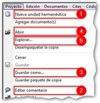
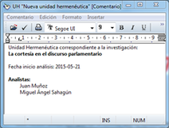
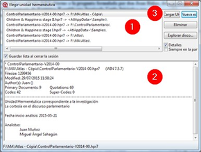

## Nuestra primera Unidad Hermenéutica

Ahora que ya estamos familiarizados con la interfaz de ATLAS.ti, y si todavía no lo habíamos hecho, podemos crear nuestra primera UH.

Para ello, simplemente tenemos que hacer clic sobre el menú *Proyecto* y seleccionar la opción *Nueva unidad hermenéutica* (1 en la figura \ref{fig-menu-proyecto}). Se abrirá entonces una nueva ventana, como la que hemos visto en la Ilustración (pág. Ilustración) en la que ya podemos empezar a trabajar.

Durante este manual insistiremos de forma reiterada en la necesidad de documentar nuestro trabajo, algo que podemos hacer de formas diferentes y en momentos diferentes. Para ir acostumbrándonos a hacerlo, el siguiente paso que sugerimos, es precisamente documentar nuestro archivo de UH. Para ello, en el mismo menú *Proyecto* haremos clic en la opción *Editar comentario* (2 en la Ilustración). Como vemos en la figura \ref{fig-comentario-UH}, se nos abrirá una nueva ventana con un editor de texto en el que escribiremos un comentario. No consideramos que sea necesario introducir una amplísima descripción, pues esto lo podemos hacer con otras herramientas, pero como mínimo deberíamos describir y/o identificar las características principales de la UH.

Una vez que hemos escrito el comentario de UH, y aunque podríamos seguir trabajando (seguro que estamos ansiosos por comenzar...), procederemos a guardar el trabajo realizado hasta el momento (sólo el comentario, pero algo es...). Para ello, utilizaremos la opción *Guardar como...* (3 en la Ilustración). Al hacer clic sobre la opción aparecerá una ventana de navegación para que seleccionemos el nombre que daremos a nuestro archivo de UH (que se guardará con la extensión *.hpr7*), y la ubicación de nuestro ordenador donde queremos guardarla. Como vemos en la figura \ref{fig-textbank}, el programa sugiere, por defecto, que guardemos el archivo en una carpeta denominada *Textbank*, aunque evidentemente podemos elegir cualquier otra ubicación. Por ejemplo podríamos crear una nueva carpeta, dentro de *Textbank*, a la que podríamos etiquetar con un nombre alusivo a nuestra investigación, por ejemplo *Control Parlamentario*, y guardar en la misma todos los documentos relativos a dicha investigación. El único requisito que consideramos imprescindible, aunque parezca algo excesivamente de sentido común como para explicitarlo, es que guardemos nuestro archivo en una ubicación que nos sea fácil de recordar, de forma que posteriormente no tengamos problemas para recuperarlo (algo que hemos visto en demasiadas ocasiones).

Podemos ahora cerrar el programa para practicar otras opciones del menú *Proyectos*.

Por el momento, simplemente volveremos a abrir ATLAS.ti para comprobar que la configuración por defecto del programa hará que nos aparezca directamente la última UH con la que se ha trabajado en ese ordenador. En el caso de que esa UH no sea aquella con la que queremos trabajar, podemos utilizar la opción *Abrir* (4 en la Ilustración) para “navegar” de la forma habitual para localizar nuestro archivo, o bien la opción *Explorar* (5 en la Ilustración) que nos abrirá una ventana con una lista de UHs abiertas recientemente en el ordenador.

En esa ventana (figura \ref{fig-explorar}) podemos ver (1), como decíamos, la lista de las últimas UHs con las que se ha trabajado en ese ordenador, junto a (2) una descripción de la UH seleccionada que incluye el comentario de UH que hemos creado previamente. Haciendo clic en (3) abriremos la UH seleccionada. El resto de opciones de esta ventana son bastante intuitivas, por lo que en vez de explicitarlas lo dejamos para que el lector explore.

