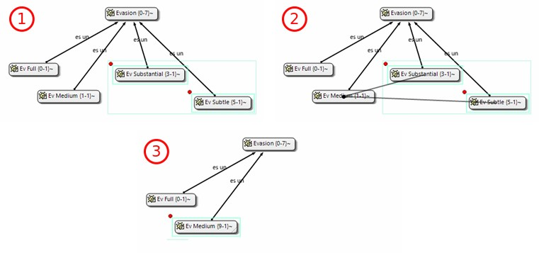

## Otras acciones

Además ce crear nuevos nodos y relaciones, desde la pantalla de *redes* también podemos realizar un par de acciones más relacionadas con los códigos: crear nuevos códigos uniendo entre sí códigos existentes, y crear nuevas familias de códigos.

### Fusionar Códigos

Anteriormente (Fusionar códigos, pág. 86) habíamos visto la posibilidad de crear nuevos códigos fusionando códigos existentes. Esta misma acción la podemos realizar en la pantalla de redes de la siguiente forma:

1) En primer lugar, tenemos que seleccionar uno o varios códigos “origen”^[La selección múltiple puede realizarse haciendo clic en varios nodos mientras se mantiene pulsada la tecla "Ctrl" o bien, si la posición de los nodos lo permite, dibujando con el ratón un rectángulo que los englobe.]. En el ejemplo de la Ilustración, hemos decidido prescindir de los códigos *Ev Substantial* y *Ev Subtle*, pues consideramos que no es necesaria una codificación tan exhaustiva y queremos fusionarlos con el código *Ev Medium*. Los seleccionamos por lo tanto, como *códigos origen* (1 en la figura \ref{fig-red-fusionar-codigo}).

2) Una vez seleccionados los nodos, utilizaremos la opción de menú Nodos &gt; Fusionar códigos. Esto hará que aparezca una línea con punto de partida en los *códigos origen* que tenemos que dirigir hacia el *código destino* (2 en la figura \ref{fig-red-fusionar-codigo}).

Como vemos en (3) en la figura \ref{fig-red-fusionar-codigo}, los *códigos origen* desaparecerán (no sólo de la *red*, sino de la UH) y sus *citas* pasarán a formar parte del *código destino* que, como vemos, antes de la fusión tenía sólo una cita y tras la fusión tiene nueve. El código resultante incluirá, además, los comentarios de los códigos origen.

### Crear Familias

En el ejemplo anterior, en el que hemos utilizado los códigos relacionados con *Evasión*, vemos que teníamos una *jerarquía* de códigos, con diferentes niveles de evasión, relacionados con un código *Evasion*. Como hemos vistgo anteriormente, esta es una de las posibilidades que tenemos de agrupar códigos, la otra es la creación de *familias*. Si en este momento constatamos la necesidad de disponer, además de las relaciones existentes, de una *familia* para los distintos niveles de *Evasion*, podemos crearla seleccionando los cuatro *códigos* con los diferentes nivels y haciendo clic en la opción de menú Especiales &gt; Generar familia &gt; Crear familia de código. Se abrirá una nueva ventana para que demos nombre a la familia (se nos sugerirá como nombre el mismo que tenga la *red*) y al hacer clic en *Ok* se creará la *familia*.

Como habremos visto al seleccionar el menú, podemos realizar esta misma operación de creación de familias con *documentos primarios* y con *memos*.
