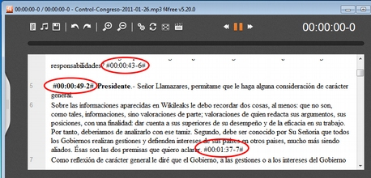
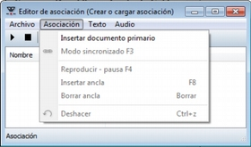
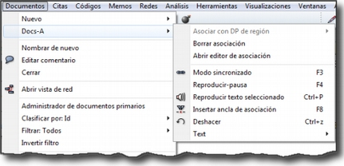
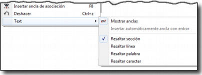

## Sincronización audio-texto

Cuando hacemos una investigación con datos basados en entrevistas, habitualmente disponemos de dos formatos de datos: el registro en audio \(y\/o vídeo\) y la transcripción en texto \(dos formatos que, como sabemos, podemos utilizar como fuentes de datos en ATLAS.ti\). Aunque teóricamente es posible realizar el análisis directamente sobre el archivo de audio o vídeo, es decir, sin disponer de una transcripción, lo que nos ocupará en este apartado es la posibilidad de utilizar ambos formatos de forma conjunta mediante la sincronización de los mismos, es decir, de forma que podamos tener un acceso rápido y fácil desde cualquier parte del texto a su equivalente en el archivo sonoro. Si alguien se pregunta por qué podríamos querer algo así, le podemos contestar con otra pregunta "¿para qué se utilizan las 'convenciones de transcripción'?". Evidentemente la respuesta en ambos casos es que nuestro análisis será mejor cuanto mayor sea la “fidelidad” de nuestros datos \(Silver & Patashnick, 2010\). Esta sincronización podemos realizarla de dos formas, con los recursos que nos ofrece el propio ATLAS.ti o bien ayudándonos de otro software, del programa de transcripción F4.

### Sincronización con F4

F4 es un programa de ayuda a la transcripción desarrollado por audiotranskription.de, una empresa dedicada a la venta de “pedales” de transcripción y que ofrece el programa a un bajo precio \(existe una versión gratuita, pero está limitada y permite un máximo de diez minutos de audio\). En este caso ilustraremos su uso con la versión 5.2 del programa. Aunque podemos utilizar F4 para realizar con su ayuda la transcripción de un archivo de sonido, aquí nos limitaremos a ilustrar su utilización para realizar la sincronización entre un archivo de texto con una transcripción que ha sido realizada de forma previa y su correspondiente archivo de audio. En la figura \ref{fig-F4} podemos ver el aspecto general del programa, mientras que en la figura \ref{fig-F4-menu} ofrecemos el detalle de las opciones de menú.

1. Crear\/Abrir archivo de texto de transcripción

2. Abrir archivo de audio\/vídeo

3. Guardar transcripción

4. Deshacer\/rehacer última acción

5. Zoom de texto

6. Menú de opciones de configuración

7. Activar\/desactivar modo sincronización

8. Pantalla completa

9. Mostrar\/ocultar ventana vídeo

10. Controles de reproducción

En primer lugar, una vez que hemos ejecutado el programa, tenemos que añadir el archivo de texto correspondiente a la transcripción. Para ello, haremos clic en \(1\) \(figura \ref{Fig-F4-menu}\) y elegiremos, el archivo sobre el que queremos realizar la sincronización. Una vez cargado ese archivo, el programa nos preguntará si queremos “cargar el archivo de medios correspondiente”, es decir, el archivo de audio o vídeo al que se corresponde el texto que hemos cargado previamente \(ver figura \ref{fig-F4-carga}\).[^1] Una vez que digamos que sí, ya podemos empezar a realizar la sincronización.

Para realizar la sincronización, iniciaremos la reproducción del archivo de audio \(10 en figura \ref{fig-F4-menu}\) y situaremos el cursor en la posición del texto en lasque queramos ubicar una marca de tiempo. Así, si por ejemplo el segundo 11 del audio se corresponde con el final del primer párrafo de la transcripción, nos situaremos en el texto al final del primer párrafo y cuando en la reproducción se alcance el segundo 11 podemos insertar la marca de tiempo utilizando la tecla F8. Como podemos ver en la figura \ref{fig-F4-marcas-tiempo}, cada vez que realicemos esa operación, se añadirá, en la posición del cursor, la marca de tiempo correspondiente.

Una vez que hemos "marcado" todo nuestro documento, ya podemos guardar la transcripción \(3 en Ilustración\). Lo conveniente es guardarla con un nombre diferente, de forma que mantengamos la versión original sin marcas de tiempo y la versión con marcas de tiempo. Una buena práctica sería etiquetar los documentos añadiendo un número de versión, por ejemplo, si estamos trabajando con las transcripción de la sesión de control del Congreso, del 26 de enero de 2011, nuestro archivo original lo etiquetaremos como “Control-Congreso-2011-01-26-00.rtf”. En este caso, los últimos dígitos “00” indican que se trata de una primera versión de la transcripción, sin marcas de tiempo. Por lo tanto, nuestro archivo con marcas de tiempo lo etiquetaremos como “Control-Congreso-2011-01-26-01.rtf”. Cualquier otro sistema puede ser válido, pero insistimos en la conveniencia de mantener la versión original y etiquetar los archivos de una forma homogénea y que nos informe claramente de las características del archivo \(para nosotros, una versión “01” siempre será un archivo con marcas de tiempo\).

Si ahora abrimos nuestro nuevo archivo desde un editor de texto \(teniendo cuidado de no realizar ninguna modificación en el mismo\), podremos ver cómo se han incorporado las marcas de tiempo \(figura \ref{fig-marcas-tiempo}\).

El siguiente paso será incorporar el texto y el audio en ATLAS.ti.

Como veíamos anteriormente \(Asignar Documentos Primarios, figura \ref{fig-Añadir-DP}\), la asignación de documentos con marcas de tiempo se realiza con la opción Documentos &gt; Nuevo &gt; Importar transcripción.[^2] Al realizar la importación seleccionaremos únicamente el archivo de texto con las marcas de tiempo \(recordamos que en nuestro caso, siempre será un archivo “01”\), y ATLAS.ti realizará automáticamente la asignación del archivo de audio correspondiente.

### Sincronizar con **ATLAS.ti**

En el caso de querer realizar la sincronización utilizando ATLAS.ti, en primer lugar tendremos que realizar el proceso de asignación de documentos de la forma habitual, asignando tanto el documento de texto como el documento de audio. Una vez asignados los documentos, seleccionamos uno de ellos, por ejemplo el documento textual y \(sólo después de haber realizado la selección de forma que lo veamos en pantalla\) en el menú _Docs-A_ seleccionamos la opción _Abrir editor de asociación_, con lo que nos aparecerá la ventana que podemos ver en la figura \ref{fig-editor-asociaciones}. Seleccionamos entonces la opción Asociación &gt; Insertar documento primario, que hará que quede seleccionado el documento activo en ese momento en la ventana principal. Repetiremos el mismo proceso con el documento de audio \(activación del documento en la pantalla principal, y Asociación &gt; Insertar documento primario\). Si hemos realizado bien los pasos, observaremos que ahora en la ventana del editor de asociaciones tenemos la referencia a los dos archivos que hemos “insertado”.

Ahora ya podemos proceder a realizar la sincronización. Para ello utilizaremos los botones del editor de asociaciones para reproducir el archivo sonoro e insertar las marcas de tiempo en la ubicación adecuada.

La estrategia que sugerimos es visualizar en la pantalla principal el archivo de texto y ubicar el cursor al inicio del mismo e insertar una primera marca de tiempo. A continuación hacemos clic sobre el icono de reproducción y escuchamos por ejemplo hasta el final del primer párrafo, momento en el cual volvemos a hacer clic para pausar la reproducción. En la pantalla de texto ubicamos el cursor al final de ese párrafo y apretamos la tecla “F8” \(o el icono del editor de asociaciones\), con lo que aparecerá un punto rojo en esa posición señalando la existencia de una marca de tiempo. Repetiremos el proceso hasta finalizar la sincronización del documento completo. En la Ilustración podemos ver un ejemplo del resultado.

### Trabajar con la sincronización

Ahora ya podemos utilizar las opciones de sincronización de ATLAS.ti. Para ello, volveremos al menú _Docs-A_ para seleccionar la forma de reproducción del texto \(figura \ref{fig-opciones-sincronizacion}\).

Si lo que queremos es ir escuchando el archivo de audio y al mismo tiempo que queden resaltados los fragmentos de texto correspondientes, en primer lugar seleccionaremos una de las opciones de Documentos &gt; Docs-A &gt; Text \*\(figura \ref{fig-sincronizacion-resaltado}\).

Por ejemplo si queremos que a medida que se va reproduciendo el audio quede resaltado el texto correspondiente \(entre dos marcas temporales\) seleccionaremos la opción _Resaltar sección._ A continuación, seleccionaremos la opción Documentos &gt; Docs-A &gt; Modo sincronizado \(o F3\), y finalmente, de nuevo en el menú Documentos &gt; Docs-A, la opción _Reproducir-pausa_ \(o F4\). Si durante la reproducción colocamos el cursor sobre otra zona de texto, la sincronización se realizará en ese punto.

[^1]: Si por cualquier motivo no cargamos el archivo de medios en ese momento, podemos hacerlo posteriormente haciendo clic en \(2\) \(figura \ref{fig-F4-menu}\).

[^2]: Esta opción sólo permite importar los documentos a la biblioteca de usuario \(Mi biblioteca\) o a la biblioteca de equipo.

