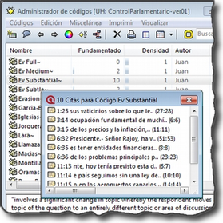

## Visualización

### Margen derecho

A medida que vamos realizando el trabajo de codificación, el margen derecho de la pantalla principal irá mostrando información sobre las citas y códigos que hemos ido creando.

En la figura \ref{fig-margen-derecho} podemos ver en el margen derecho unas barras verticales que informan de la ubicación de las citas. Si hacemos clic sobre alguna de esas barras, la cita correspondiente quedará seleccionada y resaltada en el documento. Si las citas no son citas libres y están relacionadas con códigos, a su lado aparecerá la etiqueta de los códigos correspondientes. Como podemos ver, para facilitar la visualización, tanto las barras como las etiquetas de código pueden ser de diferentes colores. En el ejemplo, tenemos seleccionada una cita codificada con el código *Ans Direct* y que se corresponde con la primera parte de la intervención de uno de los participantes. Tanto el código como la barra vertical que indica la existencia de la cita tienen el mismo color. El conjunto de la intervención está recogido en otra cita, indicada por la barra vertical gris, que a su vez está codificada como *Respuesta* y como *Zapatero,* etiquetas de código también en gris.

### Visualización de las citas de un código

Ya hemos visto que el margen derecho de la pantalla principal nos permite una visualización en contexto de nuestra codificación, es decir, a medida que vamos leyendo el texto podemos ver las citas que hemos creado y los códigos a las que han sido asignadas. Sin embargo, nos puede interesar tener una perspectiva diferente de nuestros datos, ya no según su ubicación en el documento sino en función de un rasgo o una temática concreta, es decir, focalizada en un código concreto. Con toda seguridad nos interesará ver qué fragmentos de información hemos codificado con determinados códigos. Para ello tenemos dos opciones. La primera será “navegar” en pantalla por las citas de un código. Para ello, sólo tenemos que hacer doble clic sobre un código (en el a*dministrador de códigos*), lo que nos abrirá una ventana con la lista de citas con las que está relacionado. Al hacer clic sobre cualquier cita, la visualizaremos en pantalla. También podemos realizar un “recorrido” por las citas de un código seleccionándolo y utilizando los iconos de la barra del *administrador de códigos*. En la figura \ref{fig-visualizar-citas-codigo} podemos ver cómo después de hacer doble clic sobre el código *Ev Substantial* aparece la ventana de las diez citas relacionadas con el código.

Esta forma de visualizar las citas es interesante, pero si lo que queremos es realizar una lectura más pausada de las mismas, probablemente nos sea más útil imprimir un listado de citas. De hecho, una tarea habitual del analista debería ser la lectura focalizada de las citas de códigos, para asegurarse de que todas las citas que se han incluido en un código son instancias adecuadas de ese código, para construir o refinar la definición del código y también para comparar los contenidos de dos códigos. Por ejemplo, una vez que hemos realizado una primera codificación de los códigos relacionados con las respuestas evasivas deberíamos repasar los contenidos —las citas— de cada uno de los códigos sobre evasión —*Ev Subtle*, *Ev Medium*, *Ev Substantial* y *Ev Full—* para depurarlos y, comparativamente, para asegurar que se está discriminando entre las distintas formas de evasión. Para ello, tendríamos que imprimir informes con las citas de cada uno de esos códigos (ver Informes, pág. 181).
